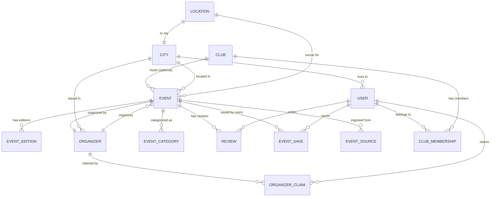

# Product Architecture Document: GoAthletix

**Version:** 1.0  
**Date:** July 2026  
**Author:** Architecture Team  
**Status:** Living Document — Updated per sprint cycle

---

## Table of Contents

1. [Executive Summary](#1-executive-summary)
2. [Main Modules](#2-main-modules)
3. [High-Level Data Model](#3-high-level-data-model)
4. [Event Ingestion Sources](#4-event-ingestion-sources)
5. [Event Normalization Pipeline](#5-event-normalization-pipeline)
6. [Search & Filtering](#6-search--filtering)
7. [Recommendations Engine](#7-recommendations-engine)
8. [Calendar Engine](#8-calendar-engine)
9. [Organizer Tools](#9-organizer-tools)
10. [WhatsApp & Instagram Workflow](#10-whatsapp--instagram-workflow)
11. [Reviews & Trust Signals](#11-reviews--trust-signals)
12. [Social / Community Layer (Future)](#12-social--community-layer-future)
13. [Technical Architecture Summary](#13-technical-architecture-summary)

---

## 1. Executive Summary

GoAthletix is a **discovery-first** sports event platform for India. It is not a ticketing platform, not a payments processor, and not a fitness tracker. Its single job is to answer the question:

> *"What running, cycling, trekking, triathlon, adventure, or fitness event should I do next — and why?"*

### Core Thesis

Event discovery in India is broken. Events are scattered across Instagram stories, WhatsApp group forwards, Townscript listings, individual organizer websites, and word-of-mouth. No single surface aggregates, normalizes, and recommends events across sports verticals. GoAthletix fills this gap.

### Strategic Constraints

| Constraint | Decision |
|---|---|
| **Not ticketing** | We link out to organizer registration pages. We do not process payments. |
| **Cold-start strategy** | Manual curation for first 500 events (Bangalore-first), then automated scraping + organizer submissions. |
| **V1 organizer wedge** | "Link-in-Bio" tool — a professional event page organizers can share on WhatsApp/Instagram. |
| **Geography** | Bangalore → NCR → Mumbai → Pune. Single city at a time. |
| **Revenue model (deferred)** | Featured listings, organizer subscriptions, affiliate commissions. Not in v1. |

### System Boundary

```
┌─────────────────────────────────────────────────────┐
│                   GoAthletix                       │
│                                                     │
│  ┌─────────┐  ┌──────────┐  ┌──────────────────┐   │
│  │ Ingest  │→ │Normalize │→ │ Event Store (PG) │   │
│  │ Pipeline│  │ Pipeline │  │ + Search (ES)    │   │
│  └─────────┘  └──────────┘  └──────────────────┘   │
│       ↑                            ↓                │
│  ┌─────────┐               ┌──────────────────┐    │
│  │ Scraper │               │  Discovery API   │    │
│  │ + Manual│               │  (REST + GraphQL)│    │
│  │ + APIs  │               └──────────────────┘    │
│  └─────────┘                       ↓                │
│                            ┌──────────────────┐    │
│                            │   Web App (Next)  │    │
│                            │   + PWA           │    │
│                            └──────────────────┘    │
│                                    ↓                │
│                            ┌──────────────────┐    │
│                            │ WhatsApp / Insta  │    │
│                            │ Share Surfaces    │    │
│                            └──────────────────┘    │
└─────────────────────────────────────────────────────┘
```

---

## 2. Main Modules

### 2.1 Module Map

| # | Module | Priority | V1 Scope | Owner |
|---|---|---|---|---|
| 1 | Event Discovery Engine | P0 | Full | Core Team |
| 2 | Data Pipeline (Ingestion + Normalization) | P0 | Full | Data Team |
| 3 | Search & Filtering | P0 | Full | Core Team |
| 4 | User Management | P0 | Auth + Profile only | Core Team |
| 5 | Organizer Tools | P0 | Event page + claim | Core Team |
| 6 | Calendar Engine | P1 | Save-to-calendar | Core Team |
| 7 | Recommendations Engine | P1 | Rule-based only | Data Team |
| 8 | Reviews & Trust Signals | P1 | Basic reviews | Core Team |
| 9 | Content / SEO Engine | P1 | Auto-generated pages | Core Team |
| 10 | Notifications | P1 | Email + push basics | Core Team |
| 11 | WhatsApp / Instagram Integration | P1 | Share links + OG cards | Core Team |
| 12 | Analytics | P2 | Basic event tracking | Data Team |
| 13 | Social / Community Layer | P2 | Future — not in v1 | — |

---

### 2.2 Module Details

#### Module 1: Event Discovery Engine

**Purpose:** The core product surface. Users land here, browse, search, filter, and find events.

**Capabilities:**
- **Feed View:** Infinite-scroll event feed, sorted by relevance (default), date, popularity, or distance
- **Map View:** Events plotted on a map with clustering (Mapbox GL or Google Maps)
- **Event Detail Page (EDP):** Rich page per event — hero image, key facts (date, distance, city, price, terrain), organizer info, past edition stats, reviews, similar events, share buttons
- **City Landing Pages:** `/bangalore/running`, `/mumbai/cycling` — SEO-optimized, city-specific discovery surfaces
- **Sport Landing Pages:** `/running`, `/cycling`, `/treks` — sport-specific aggregations
- **Curated Collections:** "Best Marathons Under ₹1000", "Weekend Treks Near Bangalore", "Beginner-Friendly Cycling Events"

**Key Design Decisions:**
- No login wall. Discovery is 100% public. Login required only for saves, reviews, and calendar sync.
- Every event has a canonical URL for SEO. Format: `/events/{slug}-{short-id}`
- Event cards show: sport icon, title, date, city, distance, price range, organizer name, trust badge (if earned)

---

#### Module 2: Data Pipeline

**Purpose:** Ingests events from all sources, normalizes them into a canonical schema, deduplicates, enriches, and loads into the event store.

**Sub-components:**

| Sub-component | Responsibility |
|---|---|
| **Collectors** | Source-specific scrapers, API clients, manual entry forms |
| **Parser** | Extracts structured data from unstructured sources (Instagram captions, WhatsApp forwards, web pages) |
| **Normalizer** | Maps raw data to canonical event schema |
| **Deduplicator** | Detects and merges duplicate events across sources |
| **Enricher** | Adds weather forecasts, elevation data, city coordinates, organizer reputation |
| **Validator** | Checks required fields, date sanity, price ranges, geo-coordinates |
| **Loader** | Writes to PostgreSQL (source of truth) + syncs to Elasticsearch (search index) |

**Pipeline Flow:**

```
Source → Collector → Raw Store (S3/JSON) → Parser → Normalizer
    → Deduplicator → Enricher → Validator → Event Store (PG)
    → Search Index (ES) → CDN Cache Invalidation
```

**Operational Rules:**
- All raw data is stored permanently in S3 (even if rejected). This is our audit trail.
- Every event gets a `source_fingerprint` (hash of source URL + title + date) for deduplication.
- Manual curation queue: events that fail validation go to a human review queue (Retool dashboard).
- Pipeline runs: scrapers execute on cron (every 6h for active sources, daily for slower ones). Manual submissions are real-time.

---

#### Module 3: Search & Filtering

**Purpose:** Powers the primary user interaction: "Find me events matching X criteria."

**Search Architecture:**
- **Primary Index:** Elasticsearch 8.x with custom analyzers for Indian city names, transliteration (Bengaluru = Bangalore), and sport-specific synonyms (marathon = full marathon = 42k)
- **Autocomplete:** Prefix-based suggestions using ES completion suggesters — covers event names, cities, organizers, sport types
- **Geo-search:** `geo_distance` queries for "events near me" with configurable radius (10km, 25km, 50km, 100km)

**Filter Dimensions:**

| Filter | Type | Values |
|---|---|---|
| Sport Type | Multi-select | Running, Cycling, Trek, Triathlon, Swimming, Adventure, Fitness, Obstacle Race, Trail Running |
| City | Multi-select + Autocomplete | All indexed cities, with state grouping |
| Date Range | Date picker | Today, This Weekend, This Month, Next 30/60/90 days, Custom |
| Distance | Range slider | 5K, 10K, 21K, 42K, 50K+, Ultra, or custom range |
| Difficulty | Single-select | Beginner, Intermediate, Advanced, Elite |
| Price | Range slider | Free, ₹0–500, ₹500–1500, ₹1500–3000, ₹3000+ |
| Terrain | Multi-select | Road, Trail, Mixed, Off-road, Water, Indoor |
| Event Format | Multi-select | Competitive, Non-competitive, Virtual, Hybrid |
| Registration Status | Single-select | Open, Closing Soon, Sold Out, Waitlist |

**Sort Options:** Relevance (default), Date (soonest first), Price (low/high), Popularity (most saved), Distance (nearest)

---

#### Module 4: User Management

**Purpose:** Authentication, profiles, preferences, and saved state.

**V1 Scope:**

| Feature | Detail |
|---|---|
| **Auth** | Google OAuth (primary), Email/password, Phone OTP (India-critical) |
| **Profile** | Name, city, sports interests, experience level, preferred distances |
| **Saved Events** | Bookmark events to a personal list |
| **Event History** | Mark events as "Attended" (self-reported) |
| **Preferences** | Sport types, cities, notification frequency |
| **Privacy** | Profile is private by default. Public opt-in for community features (future). |

**Auth Flow:**
```
User clicks "Save" on event
  → If not logged in → Modal: "Sign in to save"
  → Google OAuth / Phone OTP / Email
  → Redirect back to event with save confirmed
```

**Data Stored Per User:**
- `user_id` (UUID)
- `email`, `phone` (optional), `name`, `avatar_url`
- `auth_provider` (google, email, phone)
- `city` (primary), `sports_interests[]`, `experience_level`
- `created_at`, `last_active_at`
- `notification_preferences` (JSON)

---

#### Module 5: Organizer Tools

**Purpose:** The "Link-in-Bio" wedge. Give organizers a professional event page they can share on WhatsApp and Instagram — better than their current Canva poster + Google Form combo.

> Detailed in [Section 9: Organizer Tools](#9-organizer-tools).

---

#### Module 6: Calendar Engine

**Purpose:** Let users add events to their personal calendar (Google Calendar, Apple Calendar) and set reminders for registration deadlines.

> Detailed in [Section 8: Calendar Engine](#8-calendar-engine).

---

#### Module 7: Recommendations Engine

**Purpose:** Surface relevant events to users based on their behavior, preferences, and community signals.

> Detailed in [Section 7: Recommendations Engine](#7-recommendations-engine).

---

#### Module 8: Reviews & Trust Signals

**Purpose:** Build trust through verified participant reviews, organizer reputation scores, and safety badges.

> Detailed in [Section 11: Reviews & Trust Signals](#11-reviews--trust-signals).

---

#### Module 9: Content / SEO Engine

**Purpose:** Auto-generate SEO-optimized pages that capture long-tail search traffic.

**Page Types Generated:**

| Page Type | URL Pattern | Example |
|---|---|---|
| City + Sport | `/{city}/{sport}` | `/bangalore/running` |
| City + Sport + Year | `/{city}/{sport}/{year}` | `/bangalore/marathons/2026` |
| Event Detail | `/events/{slug}-{id}` | `/events/kaveri-trail-marathon-2026-abc123` |
| Organizer Profile | `/organizers/{slug}` | `/organizers/runners-high` |
| Collection | `/collections/{slug}` | `/collections/best-treks-near-bangalore` |
| Sport Hub | `/{sport}` | `/running` |
| Blog/Guide | `/guides/{slug}` | `/guides/first-marathon-training-plan` |

**SEO Implementation:**
- Server-side rendered (Next.js SSR/ISR) for all public pages
- Structured data (JSON-LD): `Event`, `SportsEvent`, `Organization`, `Review`, `BreadcrumbList`
- Auto-generated `<title>` and `<meta description>` from event data templates
- Canonical URLs, `hreflang` (en-IN), Open Graph + Twitter Card meta tags
- `sitemap.xml` auto-generated from event store, updated daily
- Internal linking: every event page links to city page, sport page, organizer page, and similar events

**Content Templates:**
- City pages auto-generate intro paragraphs: "Bangalore has {count} upcoming {sport} events in the next 90 days..."
- Collection pages are manually curated with editorial copy
- Guide pages are hand-written (SEO content marketing — not auto-generated slop)

---

#### Module 10: Notifications

**Purpose:** Bring users back to the platform at the right moment.

**V1 Notification Types:**

| Trigger | Channel | Timing |
|---|---|---|
| New event in saved city + sport | Email + Push | Within 24h of event being indexed |
| Registration deadline approaching (saved event) | Email + Push | 7 days, 3 days, 1 day before |
| Event date reminder (saved event) | Push | 1 day before, morning of |
| Weekly digest | Email | Every Monday 8am IST |
| Price drop / early bird ending | Email | When detected |

**Implementation:**
- Push notifications via Firebase Cloud Messaging (FCM) — works for PWA + future native app
- Email via Amazon SES (transactional) + Loops/Resend (marketing)
- Notification preferences stored per user: frequency (realtime, daily digest, weekly, off), channels (email, push, both)
- No SMS in v1 (cost-prohibitive). WhatsApp notifications are a v2 consideration.

---

#### Module 11: WhatsApp / Instagram Integration

**Purpose:** Meet users and organizers where they already are. In India, event discovery happens on WhatsApp groups and Instagram stories — not on websites.

> Detailed in [Section 10: WhatsApp & Instagram Workflow](#10-whatsapp--instagram-workflow).

---

#### Module 12: Analytics

**Purpose:** Understand user behavior, content performance, and platform health.

**V1 Analytics Stack:**

| Layer | Tool | Purpose |
|---|---|---|
| Product Analytics | PostHog (self-hosted) or Mixpanel | Funnels, retention, feature usage |
| Web Analytics | Plausible or Umami | Page views, referrers, geo (privacy-first, no cookies) |
| Search Analytics | Custom (ES query logs) | What users search for, zero-result queries, filter usage |
| Organizer Analytics | Custom dashboard | Views per event, saves, click-throughs to registration |
| Infrastructure | AWS CloudWatch + Grafana | Uptime, latency, error rates, pipeline health |

**Key Metrics Tracked:**

| Category | Metric |
|---|---|
| Acquisition | Unique visitors, new signups, traffic by source (organic, social, direct, referral) |
| Activation | First event saved, first search performed, profile completed |
| Engagement | Events viewed per session, search-to-save ratio, return visits per week |
| Content | Pages indexed, ranking positions, CTR from search |
| Organizer | Events claimed, page views per event, click-through to registration |
| Pipeline | Events ingested per day, rejection rate, dedup rate, staleness score |

---

#### Module 13: Social / Community Layer (Future)

> Detailed in [Section 12: Social / Community Layer](#12-social--community-layer-future).

---

## 3. High-Level Data Model

### 3.1 Entity Relationship Diagram



### 3.2 Entity Definitions

#### Event

The core entity. Represents a single event (not a recurring series — each occurrence is an `event_edition`).

```sql
TABLE events (
    -- Identity
    id                  UUID PRIMARY KEY DEFAULT gen_random_uuid(),
    slug                VARCHAR(255) UNIQUE NOT NULL,
    short_id            VARCHAR(12) UNIQUE NOT NULL,  -- for URLs: /events/{slug}-{short_id}
    
    -- Core Info
    title               VARCHAR(500) NOT NULL,
    description         TEXT,
    tagline             VARCHAR(200),                 -- one-liner for cards
    
    -- Classification
    sport_type          sport_type_enum NOT NULL,      -- RUNNING, CYCLING, TREK, etc.
    sub_type            VARCHAR(100),                  -- MARATHON, HALF_MARATHON, ULTRA, etc.
    event_format        event_format_enum DEFAULT 'COMPETITIVE',  -- COMPETITIVE, NON_COMPETITIVE, VIRTUAL, HYBRID
    difficulty          difficulty_enum,               -- BEGINNER, INTERMEDIATE, ADVANCED, ELITE
    terrain             terrain_enum[],                -- ROAD, TRAIL, MIXED, OFF_ROAD, WATER, INDOOR
    
    -- Date & Time
    start_date          DATE NOT NULL,
    end_date            DATE,                          -- for multi-day events
    start_time          TIME,
    timezone            VARCHAR(50) DEFAULT 'Asia/Kolkata',
    registration_opens  TIMESTAMPTZ,
    registration_closes TIMESTAMPTZ,
    early_bird_deadline TIMESTAMPTZ,
    
    -- Location
    city_id             UUID REFERENCES cities(id),
    location_id         UUID REFERENCES locations(id),
    venue_name          VARCHAR(300),
    address_text        TEXT,
    latitude            DECIMAL(10, 7),
    longitude           DECIMAL(10, 7),
    elevation_gain_m    INTEGER,                       -- for treks/trail runs
    
    -- Distance & Categories
    distances           JSONB,                         -- [{label: "Full Marathon", distance_km: 42.195, price_inr: 2500}, ...]
    min_distance_km     DECIMAL(7, 3),                 -- derived: smallest distance option
    max_distance_km     DECIMAL(7, 3),                 -- derived: largest distance option
    
    -- Pricing
    min_price_inr       INTEGER,                       -- derived: cheapest category
    max_price_inr       INTEGER,                       -- derived: most expensive category
    is_free             BOOLEAN DEFAULT FALSE,
    price_currency      VARCHAR(3) DEFAULT 'INR',
    
    -- Media
    hero_image_url      VARCHAR(2048),
    gallery_urls        TEXT[],
    route_map_url       VARCHAR(2048),
    
    -- External Links
    registration_url    VARCHAR(2048),                 -- WHERE USERS ACTUALLY REGISTER (external)
    website_url         VARCHAR(2048),
    
    -- Organizer
    organizer_id        UUID REFERENCES organizers(id),
    
    -- Metadata
    source              event_source_enum NOT NULL,    -- MANUAL, SCRAPER, ORGANIZER_SUBMIT, API, USER_SUBMIT
    source_url          VARCHAR(2048),                 -- original source for provenance
    source_fingerprint  VARCHAR(64),                   -- SHA-256 hash for dedup
    is_verified         BOOLEAN DEFAULT FALSE,         -- human-verified flag
    is_published        BOOLEAN DEFAULT TRUE,
    is_featured         BOOLEAN DEFAULT FALSE,
    quality_score       DECIMAL(3, 2),                 -- 0.00–1.00, computed by enricher
    
    -- Stats (denormalized for performance)
    save_count          INTEGER DEFAULT 0,
    review_count        INTEGER DEFAULT 0,
    avg_rating          DECIMAL(2, 1),                 -- 1.0–5.0
    view_count          INTEGER DEFAULT 0,
    click_through_count INTEGER DEFAULT 0,             -- clicks to registration_url
    
    -- Timestamps
    created_at          TIMESTAMPTZ DEFAULT NOW(),
    updated_at          TIMESTAMPTZ DEFAULT NOW(),
    indexed_at          TIMESTAMPTZ,                   -- last ES sync time
    last_scraped_at     TIMESTAMPTZ
);

-- Indexes
CREATE INDEX idx_events_sport_type ON events(sport_type);
CREATE INDEX idx_events_city_id ON events(city_id);
CREATE INDEX idx_events_start_date ON events(start_date);
CREATE INDEX idx_events_organizer_id ON events(organizer_id);
CREATE INDEX idx_events_source_fingerprint ON events(source_fingerprint);
CREATE INDEX idx_events_geo ON events USING GIST (
    ST_SetSRID(ST_MakePoint(longitude, latitude), 4326)
);
CREATE INDEX idx_events_published_date ON events(is_published, start_date)
    WHERE is_published = TRUE;
```

**Enum Types:**

```sql
CREATE TYPE sport_type_enum AS ENUM (
    'RUNNING', 'CYCLING', 'TREK', 'TRIATHLON', 'SWIMMING',
    'ADVENTURE', 'FITNESS', 'OBSTACLE_RACE', 'TRAIL_RUNNING',
    'DUATHLON', 'ULTRA_RUNNING', 'VIRTUAL', 'OTHER'
);

CREATE TYPE event_format_enum AS ENUM (
    'COMPETITIVE', 'NON_COMPETITIVE', 'VIRTUAL', 'HYBRID'
);

CREATE TYPE difficulty_enum AS ENUM (
    'BEGINNER', 'INTERMEDIATE', 'ADVANCED', 'ELITE'
);

CREATE TYPE terrain_enum AS ENUM (
    'ROAD', 'TRAIL', 'MIXED', 'OFF_ROAD', 'WATER', 'INDOOR'
);

CREATE TYPE event_source_enum AS ENUM (
    'MANUAL', 'SCRAPER', 'ORGANIZER_SUBMIT', 'PARTNER_API',
    'USER_SUBMIT', 'INSTAGRAM', 'WHATSAPP'
);
```

---

#### Event Edition (for recurring events)

```sql
TABLE event_editions (
    id                  UUID PRIMARY KEY DEFAULT gen_random_uuid(),
    event_id            UUID REFERENCES events(id) NOT NULL,
    edition_number      INTEGER,                       -- "7th edition"
    edition_year        INTEGER NOT NULL,
    edition_label       VARCHAR(100),                  -- "2026 Edition"
    
    -- Override fields (NULL = inherit from parent event)
    start_date          DATE,
    end_date            DATE,
    registration_url    VARCHAR(2048),
    distances           JSONB,
    min_price_inr       INTEGER,
    max_price_inr       INTEGER,
    hero_image_url      VARCHAR(2048),
    
    -- Stats for this edition
    participant_count   INTEGER,                       -- reported/estimated
    finisher_count      INTEGER,
    dnf_count           INTEGER,
    
    created_at          TIMESTAMPTZ DEFAULT NOW(),
    updated_at          TIMESTAMPTZ DEFAULT NOW()
);
```

---

#### Organizer

```sql
TABLE organizers (
    id                  UUID PRIMARY KEY DEFAULT gen_random_uuid(),
    slug                VARCHAR(255) UNIQUE NOT NULL,
    
    -- Identity
    name                VARCHAR(300) NOT NULL,
    legal_name          VARCHAR(500),
    description         TEXT,
    tagline             VARCHAR(200),
    
    -- Contact
    email               VARCHAR(255),
    phone               VARCHAR(20),
    website_url         VARCHAR(2048),
    
    -- Social
    instagram_handle    VARCHAR(100),
    facebook_url        VARCHAR(2048),
    twitter_handle      VARCHAR(100),
    youtube_url         VARCHAR(2048),
    strava_club_url     VARCHAR(2048),
    
    -- Location
    city_id             UUID REFERENCES cities(id),
    state               VARCHAR(100),
    
    -- Media
    logo_url            VARCHAR(2048),
    cover_image_url     VARCHAR(2048),
    
    -- Trust & Verification
    is_verified         BOOLEAN DEFAULT FALSE,         -- manually verified by our team
    is_claimed          BOOLEAN DEFAULT FALSE,         -- organizer has claimed this profile
    claimed_by_user_id  UUID REFERENCES users(id),
    verification_date   DATE,
    years_active        INTEGER,
    total_events_hosted INTEGER DEFAULT 0,             -- denormalized
    
    -- Reputation (computed)
    reputation_score    DECIMAL(3, 2),                 -- 0.00–1.00
    avg_event_rating    DECIMAL(2, 1),
    total_reviews       INTEGER DEFAULT 0,
    
    -- Metadata
    source              event_source_enum,
    created_at          TIMESTAMPTZ DEFAULT NOW(),
    updated_at          TIMESTAMPTZ DEFAULT NOW()
);
```

---

#### User

```sql
TABLE users (
    id                  UUID PRIMARY KEY DEFAULT gen_random_uuid(),
    
    -- Auth
    email               VARCHAR(255) UNIQUE,
    phone               VARCHAR(20) UNIQUE,
    password_hash       VARCHAR(255),                  -- NULL for OAuth-only users
    auth_provider       auth_provider_enum NOT NULL,   -- GOOGLE, EMAIL, PHONE
    auth_provider_id    VARCHAR(255),                  -- OAuth provider's user ID
    
    -- Profile
    name                VARCHAR(200) NOT NULL,
    display_name        VARCHAR(100),
    avatar_url          VARCHAR(2048),
    bio                 TEXT,
    
    -- Location
    city_id             UUID REFERENCES cities(id),
    city_name           VARCHAR(100),                  -- denormalized for display
    
    -- Preferences
    sports_interests    sport_type_enum[],
    experience_level    difficulty_enum,
    preferred_distances JSONB,                         -- {running: [10, 21], cycling: [50, 100]}
    notification_prefs  JSONB,                         -- {email: true, push: true, frequency: 'weekly'}
    
    -- Activity Stats (denormalized)
    events_saved_count  INTEGER DEFAULT 0,
    events_attended_count INTEGER DEFAULT 0,
    reviews_written_count INTEGER DEFAULT 0,
    
    -- Privacy
    is_profile_public   BOOLEAN DEFAULT FALSE,
    
    -- Admin
    role                user_role_enum DEFAULT 'USER', -- USER, ORGANIZER, ADMIN, CURATOR
    is_active           BOOLEAN DEFAULT TRUE,
    
    -- Timestamps
    created_at          TIMESTAMPTZ DEFAULT NOW(),
    updated_at          TIMESTAMPTZ DEFAULT NOW(),
    last_active_at      TIMESTAMPTZ,
    last_login_at       TIMESTAMPTZ
);

CREATE TYPE auth_provider_enum AS ENUM ('GOOGLE', 'EMAIL', 'PHONE');
CREATE TYPE user_role_enum AS ENUM ('USER', 'ORGANIZER', 'ADMIN', 'CURATOR');
```

---

#### Review

```sql
TABLE reviews (
    id                  UUID PRIMARY KEY DEFAULT gen_random_uuid(),
    
    -- What's being reviewed
    event_id            UUID REFERENCES events(id) NOT NULL,
    edition_id          UUID REFERENCES event_editions(id),  -- optional: specific edition
    
    -- Who's reviewing
    user_id             UUID REFERENCES users(id) NOT NULL,
    
    -- Review Content
    overall_rating      SMALLINT NOT NULL CHECK (overall_rating BETWEEN 1 AND 5),
    
    -- Dimension Ratings (1–5, optional)
    organization_rating SMALLINT CHECK (organization_rating BETWEEN 1 AND 5),
    route_rating        SMALLINT CHECK (route_rating BETWEEN 1 AND 5),
    safety_rating       SMALLINT CHECK (safety_rating BETWEEN 1 AND 5),
    value_rating        SMALLINT CHECK (value_rating BETWEEN 1 AND 5),  -- value for money
    atmosphere_rating   SMALLINT CHECK (atmosphere_rating BETWEEN 1 AND 5),
    
    -- Written Review
    title               VARCHAR(200),
    body                TEXT,
    pros                TEXT[],                        -- quick tags: "Good route", "Well organized"
    cons                TEXT[],                        -- quick tags: "Poor hydration", "Confusing route marks"
    
    -- Verification
    is_verified_participant BOOLEAN DEFAULT FALSE,     -- did they actually attend?
    proof_type          VARCHAR(50),                   -- STRAVA_ACTIVITY, PHOTO, RESULT_LINK
    proof_url           VARCHAR(2048),
    
    -- Photos
    photo_urls          TEXT[],
    
    -- Moderation
    is_approved         BOOLEAN DEFAULT TRUE,
    is_flagged          BOOLEAN DEFAULT FALSE,
    flag_reason         TEXT,
    moderated_at        TIMESTAMPTZ,
    moderated_by        UUID REFERENCES users(id),
    
    -- Engagement
    helpful_count       INTEGER DEFAULT 0,
    report_count        INTEGER DEFAULT 0,
    
    -- Timestamps
    created_at          TIMESTAMPTZ DEFAULT NOW(),
    updated_at          TIMESTAMPTZ DEFAULT NOW(),
    
    -- Constraints
    UNIQUE(event_id, user_id)                          -- one review per user per event
);
```

---

#### Club / Community

```sql
TABLE clubs (
    id                  UUID PRIMARY KEY DEFAULT gen_random_uuid(),
    slug                VARCHAR(255) UNIQUE NOT NULL,
    
    -- Identity
    name                VARCHAR(300) NOT NULL,
    description         TEXT,
    sport_type          sport_type_enum,
    
    -- Location
    city_id             UUID REFERENCES cities(id),
    
    -- Media
    logo_url            VARCHAR(2048),
    cover_image_url     VARCHAR(2048),
    
    -- External Links
    website_url         VARCHAR(2048),
    instagram_handle    VARCHAR(100),
    strava_club_url     VARCHAR(2048),
    whatsapp_group_url  VARCHAR(2048),
    
    -- Metadata
    member_count        INTEGER DEFAULT 0,
    is_verified         BOOLEAN DEFAULT FALSE,
    founded_year        INTEGER,
    
    -- Admin
    created_by_user_id  UUID REFERENCES users(id),
    
    -- Timestamps
    created_at          TIMESTAMPTZ DEFAULT NOW(),
    updated_at          TIMESTAMPTZ DEFAULT NOW()
);

TABLE club_memberships (
    id                  UUID PRIMARY KEY DEFAULT gen_random_uuid(),
    club_id             UUID REFERENCES clubs(id) NOT NULL,
    user_id             UUID REFERENCES users(id) NOT NULL,
    role                club_role_enum DEFAULT 'MEMBER',  -- ADMIN, MODERATOR, MEMBER
    joined_at           TIMESTAMPTZ DEFAULT NOW(),
    UNIQUE(club_id, user_id)
);

CREATE TYPE club_role_enum AS ENUM ('ADMIN', 'MODERATOR', 'MEMBER');
```

---

#### City / Location

```sql
TABLE cities (
    id                  UUID PRIMARY KEY DEFAULT gen_random_uuid(),
    
    -- Identity
    name                VARCHAR(200) NOT NULL,
    slug                VARCHAR(100) UNIQUE NOT NULL,
    alternate_names     TEXT[],                         -- ["Bengaluru", "Bangalore", "BLR"]
    
    -- Geo
    state               VARCHAR(100) NOT NULL,
    country             VARCHAR(100) DEFAULT 'India',
    latitude            DECIMAL(10, 7),
    longitude           DECIMAL(10, 7),
    
    -- Metadata
    tier                city_tier_enum,                 -- TIER_1, TIER_2, TIER_3
    is_active           BOOLEAN DEFAULT FALSE,          -- only active cities are shown in UI
    event_count         INTEGER DEFAULT 0,              -- denormalized
    
    -- SEO
    seo_title           VARCHAR(200),
    seo_description     VARCHAR(500),
    hero_image_url      VARCHAR(2048),
    
    created_at          TIMESTAMPTZ DEFAULT NOW(),
    updated_at          TIMESTAMPTZ DEFAULT NOW()
);

CREATE TYPE city_tier_enum AS ENUM ('TIER_1', 'TIER_2', 'TIER_3');

TABLE locations (
    id                  UUID PRIMARY KEY DEFAULT gen_random_uuid(),
    
    -- Identity
    name                VARCHAR(300) NOT NULL,          -- "Kanteerava Stadium", "Cubbon Park"
    venue_type          VARCHAR(100),                   -- STADIUM, PARK, TRAIL, ROAD_CIRCUIT, BEACH
    
    -- Geo
    city_id             UUID REFERENCES cities(id),
    address             TEXT,
    latitude            DECIMAL(10, 7),
    longitude           DECIMAL(10, 7),
    
    -- Google Maps
    google_place_id     VARCHAR(300),
    google_maps_url     VARCHAR(2048),
    
    -- Metadata
    event_count         INTEGER DEFAULT 0,
    
    created_at          TIMESTAMPTZ DEFAULT NOW(),
    updated_at          TIMESTAMPTZ DEFAULT NOW()
);
```

---

#### Supporting Tables

```sql
-- Event saves (bookmarks)
TABLE event_saves (
    id                  UUID PRIMARY KEY DEFAULT gen_random_uuid(),
    user_id             UUID REFERENCES users(id) NOT NULL,
    event_id            UUID REFERENCES events(id) NOT NULL,
    created_at          TIMESTAMPTZ DEFAULT NOW(),
    UNIQUE(user_id, event_id)
);

-- Event sources (provenance tracking)
TABLE event_sources (
    id                  UUID PRIMARY KEY DEFAULT gen_random_uuid(),
    event_id            UUID REFERENCES events(id) NOT NULL,
    source_type         event_source_enum NOT NULL,
    source_url          VARCHAR(2048),
    source_fingerprint  VARCHAR(64),
    raw_data            JSONB,                          -- original scraped/submitted data
    ingested_at         TIMESTAMPTZ DEFAULT NOW(),
    processed_at        TIMESTAMPTZ
);

-- User event attendance (self-reported)
TABLE event_attendance (
    id                  UUID PRIMARY KEY DEFAULT gen_random_uuid(),
    user_id             UUID REFERENCES users(id) NOT NULL,
    event_id            UUID REFERENCES events(id) NOT NULL,
    attended            BOOLEAN DEFAULT TRUE,
    finish_time         INTERVAL,                       -- optional: self-reported finish time
    notes               TEXT,
    created_at          TIMESTAMPTZ DEFAULT NOW(),
    UNIQUE(user_id, event_id)
);
```

---

### 3.3 Relationships Summary

| From | To | Relationship | Cardinality |
|---|---|---|---|
| Event | Organizer | belongs to | Many-to-One |
| Event | City | located in | Many-to-One |
| Event | Location | held at | Many-to-One |
| Event | Event Edition | has editions | One-to-Many |
| Event | Review | has reviews | One-to-Many |
| Event | Event Save | saved by users | One-to-Many |
| Event | Event Source | ingested from | One-to-Many |
| User | Review | writes reviews | One-to-Many |
| User | Event Save | saves events | One-to-Many |
| User | Club Membership | belongs to clubs | One-to-Many |
| User | Organizer Claim | claims organizer profiles | One-to-Many |
| Club | Club Membership | has members | One-to-Many |
| Club | City | based in | Many-to-One |
| Organizer | City | based in | Many-to-One |

---

## 4. Event Ingestion Sources

### 4.1 Source Hierarchy

Events enter the platform from multiple sources, each with different data quality, volume, and trust levels:

| Source | Volume | Data Quality | Trust Level | V1 Priority |
|---|---|---|---|---|
| Manual Curation | Low (10–20/week) | Highest | Verified | P0 — primary for launch |
| Organizer Self-Submit | Medium (grows over time) | High | High (after claim) | P0 |
| Web Scrapers | High (100+/week at scale) | Medium | Needs verification | P1 |
| Instagram Parsing | Medium | Low–Medium | Needs verification | P1 |
| WhatsApp Forwarded Content | Low–Medium | Low | Needs verification | P2 |
| Partner APIs (Townscript, etc.) | Medium | High | High | P2 |
| User Submissions | Low | Variable | Needs verification | P1 |

---

### 4.2 Source Details

#### Source 1: Manual Curation (V1 Primary)

**How it works:**
- A human curator (the founding team) manually finds events by browsing Instagram pages, organizer websites, WhatsApp groups, and community forums.
- Events are entered through an internal Retool dashboard with a structured form.
- Every manually entered event is automatically `is_verified = TRUE`.

**Target sources for manual curation:**
- Instagram accounts of ~100 Bangalore-based running/cycling/trek organizers
- Townscript listings (browsed manually, not scraped yet)
- Popular WhatsApp groups for Bangalore runners/cyclists
- BhaagIndia, IndiaRunning, RaceDay listings
- Facebook groups (Bangalore Runners, Cyclists of Bangalore, etc.)

**Quality controls:**
- Required fields enforced: title, sport_type, start_date, city, at least one distance/category, registration_url
- Image quality check: hero image must be ≥800px wide
- Date sanity: start_date must be in the future
- Price normalization: all prices in INR, converted if needed

---

#### Source 2: Organizer Self-Submit

**How it works:**
- Organizers sign up, claim their profile, and submit events through a guided multi-step form.
- Form mirrors the internal curation form but has a simpler UX with progressive disclosure.
- Submitted events go through a lightweight review queue before publishing (auto-approved after organizer earns trust).

**Submission Form Fields:**

| Step | Fields |
|---|---|
| **Basics** | Title, Sport Type, Sub-type, Event Format, Description |
| **Date & Location** | Start Date, End Date, City (autocomplete), Venue Name, Address, Map Pin |
| **Categories** | Add distance categories with labels, distances, prices |
| **Media** | Hero Image (upload or URL), Gallery, Route Map |
| **Registration** | Registration URL, Registration Open/Close dates, Early Bird deadline |
| **Extras** | Difficulty, Terrain, Tags, Past edition stats |

**Anti-spam measures:**
- Phone OTP verification required for organizer signup
- Rate limit: max 10 event submissions per organizer per month
- Duplicate detection against existing events
- Manual review for first 3 submissions from any new organizer

---

#### Source 3: Web Scrapers

**Target websites and scraping approach:**

| Target | Method | Frequency | Data Extracted |
|---|---|---|---|
| Townscript event pages | HTTP scraper + Cheerio | Every 6h | Title, date, location, price, description, image |
| BhaagIndia listings | HTTP scraper | Daily | Event name, date, city, distance, link |
| IndiaRunning calendar | HTTP scraper | Daily | Event name, date, city, distance |
| Explara events | HTTP scraper | Daily | Title, date, location, price, categories |
| Individual organizer websites | Custom per-site scrapers | Daily | Varies — usually event name, date, price, link |

**Scraper architecture:**
- Built with Playwright (headless Chrome) for JS-rendered pages, Cheerio for static HTML
- Each scraper is a self-contained module: `scrapers/{source_name}/index.ts`
- Outputs standardized `RawEvent` JSON to S3
- Scraper health dashboard: monitors success rates, checks for site structure changes
- Alerting: if a scraper's success rate drops below 80%, alert the team

**Legal considerations:**
- All scraped data is publicly available
- We link back to original sources (good SEO practice + attribution)
- `robots.txt` is respected
- We do not scrape behind login walls

---

#### Source 4: Instagram Parsing

**How it works:**

Indian event organizers announce events primarily through Instagram posts and stories. The typical pattern:

```
Instagram Post:
  📸 Event poster (Canva-designed image with text)
  📝 Caption with date, location, registration link
  🔗 Link in bio (usually to Google Form or Townscript)
```

**Parsing pipeline:**
1. **Monitor:** Track Instagram accounts of known organizers (public profiles only, via Instagram Basic Display API or third-party tools like Apify)
2. **Detect:** Identify posts that are event announcements (vs. results, photos, stories)
   - Heuristics: contains date patterns, registration keywords, location names, price mentions
   - OCR on images: extract text from event posters using Tesseract or Google Vision API
3. **Extract:** Pull structured data from caption + OCR text
   - Date extraction (regex + NLP): "March 15, 2026" / "15th March" / "15/03/2026"
   - Location extraction: match against city database + Google Places
   - Price extraction: ₹ symbol + number patterns
   - Registration link: URL in bio or caption
4. **Create:** Generate `RawEvent` and send to normalization pipeline
5. **Verify:** Flag for human review (Instagram-sourced events are never auto-published)

**Challenges & mitigations:**

| Challenge | Mitigation |
|---|---|
| Instagram API rate limits | Use third-party scraping services (Apify, Phantombuster) as fallback |
| Event poster text in images (not machine-readable) | OCR pipeline with confidence scoring |
| Dates in Indian formats ("15th March" vs "3/15") | Custom date parser trained on Indian date formats |
| Multiple events in one post | Split detection heuristics |
| Stories disappear in 24h | Process stories within 6h window |

---

#### Source 5: WhatsApp Forwarded Content

**How it works:**

In India, event announcements are frequently shared as forwards in WhatsApp groups. The typical format:

```
🏃 *Bangalore Marathon 2026*
📅 Date: 15th March 2026
📍 Location: Kanteerava Stadium
💰 Entry: ₹1500 onwards
🔗 Register: https://townscript.com/...
Contact: +91 98765 43210
```

**Ingestion approach (V1):**
- **Not automated.** WhatsApp scraping is against ToS and legally risky.
- Instead: a dedicated WhatsApp number where users/organizers can forward event details.
- Forwarded messages are processed by a human curator assisted by an LLM-based parser.
- The parser extracts structured fields from the forwarded text and pre-fills the curation form.

**Future (V2+):**
- WhatsApp Business API chatbot that accepts forwarded event details and confirms extraction
- User-facing: "Forward event to us on WhatsApp" — a simple CTA on the website

**LLM-based parser prompt (simplified):**

```
Given the following WhatsApp message about a sports event, 
extract these fields as JSON:
- title, sport_type, start_date, city, venue, 
- distances[], prices[], registration_url, 
- organizer_name, contact_phone
- confidence_score (0-1)

Message: {forwarded_text}
```

---

#### Source 6: Partner APIs

**Planned integrations (V2+):**

| Partner | API Type | Data Available | Status |
|---|---|---|---|
| Townscript | REST API (if available) | Events, tickets, venues | Investigate |
| Strava | OAuth REST API | Clubs, routes, segments | Read-only, for enrichment |
| Google Calendar | CalDAV / Google API | User calendar events | For calendar sync feature |
| OpenWeatherMap | REST API | Weather forecasts | For event-day weather display |
| MapMyRun / MapMyRide | REST API | Routes, elevation | For route enrichment |

---

#### Source 7: User Submissions

**How it works:**
- Any logged-in user can submit an event they know about via a simplified form.
- Required fields: title, sport type, date, city, link/source
- User-submitted events go to the review queue (never auto-published).
- Users earn karma/trust for submitting events that get published.

**Simplified submission form:**
```
Title: [___________________]
Sport:  [Running ▼]
Date:   [Date Picker]
City:   [Autocomplete]
Link:   [URL to event page or Instagram post]
Notes:  [Optional free text]
[Submit]
```

---

## 5. Event Normalization Pipeline

### 5.1 Pipeline Overview

Raw event data from all sources enters the normalization pipeline, which produces clean, consistent, enriched event records ready for the event store and search index.

```
┌──────────┐    ┌──────────┐    ┌──────────┐    ┌──────────┐    ┌──────────┐    ┌──────────┐
│  CLEAN   │ →  │CATEGORIZE│ →  │ DEDUP    │ →  │ ENRICH   │ →  │ VALIDATE │ →  │  STORE   │
│          │    │          │    │          │    │          │    │          │    │          │
│ - Trim   │    │ - Sport  │    │ - Hash   │    │ - Geo    │    │ - Schema │    │ - PG     │
│ - Format │    │ - Type   │    │ - Match  │    │ - Weather│    │ - Logic  │    │ - ES     │
│ - Fix    │    │ - Tags   │    │ - Merge  │    │ - Org    │    │ - Score  │    │ - Cache  │
└──────────┘    └──────────┘    └──────────┘    └──────────┘    └──────────┘    └──────────┘
```

### 5.2 Stage 1: Cleaning

**Text Cleaning:**
- Strip HTML tags, excessive whitespace, emoji (preserve in description, remove from titles)
- Normalize Unicode (NFKD): convert "₹" variations, smart quotes, en-dashes
- Title case normalization: "BANGALORE MARATHON 2026" → "Bangalore Marathon 2026"
- Remove promotional fluff from titles: strip "Register Now!", "Early Bird!", etc.

**Date Cleaning:**
- Parse Indian date formats: "15th March", "15-03-2026", "March 15, 2026", "15/3/26"
- Handle relative dates: "This Sunday", "Next Saturday" → absolute date
- Timezone normalization: assume IST (Asia/Kolkata) unless explicitly stated
- Sanity check: reject dates in the past, more than 18 months in the future, or on impossible dates

**Price Cleaning:**
- Extract numeric values from strings: "₹1,500" → 1500, "Rs. 2000/-" → 2000, "INR 500" → 500
- Handle ranges: "₹1500–2500" → min_price: 1500, max_price: 2500
- Handle "Free" / "No entry fee" → is_free: true, min_price: 0

**Location Cleaning:**
- City name normalization using alias table: "Bengaluru" = "Bangalore" = "BLR"
- Address formatting: ensure state and PIN code are included
- Geo-coordinate validation: must fall within India's bounding box (6.7°N–35.5°N, 68.1°E–97.4°E)

---

### 5.3 Stage 2: Categorization

**Sport Type Classification:**

Uses a keyword-based classifier with fallback to LLM classification:

```
Keywords → Sport Type mapping:
  marathon, half marathon, 10k, 5k, fun run, running → RUNNING
  century ride, gran fondo, cycling, bikeathon      → CYCLING
  trek, hiking, trekking, nature walk                → TREK
  triathlon, ironman, sprint tri, olympic tri        → TRIATHLON
  trail run, trail race, ultra trail                 → TRAIL_RUNNING
  obstacle, spartan, mud run, OCR                    → OBSTACLE_RACE
  swim, open water, pool race                        → SWIMMING
  duathlon, aquathlon                                → DUATHLON
  rafting, paragliding, bungee, rock climbing        → ADVENTURE
  yoga, crossfit, bootcamp, zumba, workout           → FITNESS
```

**Sub-type Classification (within Running):**

| Sub-type | Detection Rule |
|---|---|
| Ultra Marathon | distance > 42.195km OR keywords: ultra, 50k, 100k, 100 miler |
| Full Marathon | distance = 42.195km OR keywords: marathon (without "half") |
| Half Marathon | distance = 21.1km OR keywords: half marathon, 21k |
| 10K | distance = 10km OR keywords: 10k, 10km |
| 5K | distance = 5km OR keywords: 5k, 5km, fun run |
| Trail Run | keywords: trail + running/run |

**Difficulty Classification:**

| Difficulty | Rules |
|---|---|
| Beginner | 5K/10K runs, short treks (<10km, <500m elevation), non-competitive events |
| Intermediate | Half marathon, medium treks (10–20km, 500–1500m elevation), sprint triathlon |
| Advanced | Full marathon, long treks (>20km, >1500m elevation), Olympic triathlon |
| Elite | Ultra marathon, Ironman, technical alpine treks, multi-day stage races |

---

### 5.4 Stage 3: Deduplication

**Problem:** The same event may be ingested from multiple sources (organizer's Instagram, Townscript listing, WhatsApp forward, user submission). We need to detect these duplicates and merge them into a single canonical event.

**Dedup Strategy (Three-layer):**

**Layer 1: Exact Fingerprint Match**
```
fingerprint = SHA-256(
    lowercase(title) + 
    start_date.toISOString() + 
    lowercase(city_name)
)
```
If fingerprint matches an existing event → merge (update fields, add source reference).

**Layer 2: Fuzzy Title + Date Match**
```
score = (
    levenshtein_similarity(title_a, title_b) * 0.5 +
    date_match(date_a, date_b) * 0.3 +
    city_match(city_a, city_b) * 0.2
)
if score > 0.85 → flag as probable duplicate for human review
if score > 0.95 → auto-merge
```

**Layer 3: URL Dedup**
If `registration_url` or `source_url` matches an existing event → auto-merge (same event, different scrape).

**Merge Rules:**
- When merging, keep the record with more complete data as the primary.
- Never overwrite `is_verified = TRUE` with `FALSE`.
- Merge media: union of all images across sources.
- Keep all source references in `event_sources` table for provenance.

---

### 5.5 Stage 4: Enrichment

After cleaning, categorizing, and deduplicating, events are enriched with additional data:

| Enrichment | Source | Data Added |
|---|---|---|
| **Geo-coordinates** | Google Geocoding API | latitude, longitude from address/venue name |
| **Elevation data** | OpenTopoData API | elevation_gain_m for treks and trail runs |
| **Weather forecast** | OpenWeatherMap | Expected conditions on event day (added to EDP, not stored permanently) |
| **Organizer linking** | Internal DB | Match organizer by name/URL, create if new |
| **City linking** | Internal DB | Match city from address/venue, using alias table |
| **Location linking** | Internal DB + Google Places | Match or create venue record |
| **Quality scoring** | Internal algorithm | Compute 0–1 quality score based on data completeness |
| **Past editions** | Internal DB | Link to previous editions of the same event series |
| **Distance derivation** | From categories | Compute min_distance_km, max_distance_km |
| **Price derivation** | From categories | Compute min_price_inr, max_price_inr, is_free |

**Quality Score Calculation:**

```
quality_score = weighted_sum([
    has_title:              0.10,
    has_description(>100c): 0.10,
    has_hero_image:         0.15,
    has_exact_date:         0.10,
    has_location_coords:    0.10,
    has_registration_url:   0.10,
    has_prices:             0.05,
    has_distance_info:      0.10,
    is_verified:            0.10,
    has_organizer_linked:   0.05,
    has_route_map:          0.05,
])
```

Events with `quality_score < 0.40` are sent to the review queue instead of being auto-published.

---

### 5.6 Stage 5: Validation

Final checks before writing to the event store:

| Rule | Action on Failure |
|---|---|
| `title` is present and ≤500 chars | Reject |
| `sport_type` is a valid enum value | Reject |
| `start_date` is in the future | Reject |
| `start_date` is within 18 months | Reject |
| `city_id` references a valid city | Send to review queue |
| `min_price_inr` ≥ 0 | Set to 0 |
| `registration_url` is a valid URL | Set to NULL (event still published) |
| `hero_image_url` returns 200 OK | Set to NULL (use placeholder) |
| No duplicate found in DB | Proceed |
| Duplicate found (high confidence) | Merge |
| Duplicate found (low confidence) | Send to review queue |

---

## 6. Search & Filtering

### 6.1 Search Architecture

```
┌──────────┐     ┌──────────────┐     ┌───────────┐
│  User    │ →   │  API Gateway │ →   │  Search   │
│  Query   │     │  (Next.js)   │     │  Service  │
└──────────┘     └──────────────┘     └───────────┘
                                           │
                       ┌───────────────────┼───────────────────┐
                       ▼                   ▼                   ▼
                ┌──────────────┐    ┌──────────────┐    ┌──────────────┐
                │ Elasticsearch│    │  PostgreSQL  │    │  Redis Cache │
                │  (Primary)   │    │  (Fallback)  │    │  (Hot)       │
                └──────────────┘    └──────────────┘    └──────────────┘
```

### 6.2 Elasticsearch Index Mapping

```json
{
  "events": {
    "mappings": {
      "properties": {
        "id":                { "type": "keyword" },
        "title":             { "type": "text", "analyzer": "event_analyzer", "fields": { "keyword": { "type": "keyword" }, "suggest": { "type": "completion" } } },
        "description":       { "type": "text", "analyzer": "event_analyzer" },
        "sport_type":        { "type": "keyword" },
        "sub_type":          { "type": "keyword" },
        "event_format":      { "type": "keyword" },
        "difficulty":        { "type": "keyword" },
        "terrain":           { "type": "keyword" },
        
        "start_date":        { "type": "date" },
        "end_date":          { "type": "date" },
        "registration_closes": { "type": "date" },
        
        "city_name":         { "type": "keyword" },
        "city_slug":         { "type": "keyword" },
        "state":             { "type": "keyword" },
        "location":          { "type": "geo_point" },
        
        "min_distance_km":   { "type": "float" },
        "max_distance_km":   { "type": "float" },
        "min_price_inr":     { "type": "integer" },
        "max_price_inr":     { "type": "integer" },
        "is_free":           { "type": "boolean" },
        
        "organizer_name":    { "type": "text", "fields": { "keyword": { "type": "keyword" } } },
        "organizer_slug":    { "type": "keyword" },
        
        "is_verified":       { "type": "boolean" },
        "is_featured":       { "type": "boolean" },
        "quality_score":     { "type": "float" },
        
        "save_count":        { "type": "integer" },
        "review_count":      { "type": "integer" },
        "avg_rating":        { "type": "float" },
        "view_count":        { "type": "integer" },
        
        "hero_image_url":    { "type": "keyword", "index": false },
        "registration_url":  { "type": "keyword", "index": false },
        "slug":              { "type": "keyword" },
        "short_id":          { "type": "keyword" },
        
        "created_at":        { "type": "date" },
        "updated_at":        { "type": "date" }
      }
    }
  }
}
```

### 6.3 Custom Analyzer

```json
{
  "settings": {
    "analysis": {
      "analyzer": {
        "event_analyzer": {
          "type": "custom",
          "tokenizer": "standard",
          "filter": ["lowercase", "indian_city_synonyms", "sport_synonyms", "stop", "snowball"]
        }
      },
      "filter": {
        "indian_city_synonyms": {
          "type": "synonym",
          "synonyms": [
            "bengaluru, bangalore, blr",
            "mumbai, bombay",
            "chennai, madras",
            "kolkata, calcutta",
            "ncr, delhi, new delhi, noida, gurgaon, gurugram, faridabad, ghaziabad",
            "trivandrum, thiruvananthapuram",
            "mysuru, mysore",
            "kochi, cochin"
          ]
        },
        "sport_synonyms": {
          "type": "synonym",
          "synonyms": [
            "marathon, full marathon, 42k, 42.195k",
            "half marathon, hm, 21k, 21.1k",
            "trek, trekking, hike, hiking",
            "cycling, biking, bike ride, cycle ride",
            "triathlon, tri, ironman",
            "obstacle, ocr, spartan, mud run"
          ]
        }
      }
    }
  }
}
```

### 6.4 Search Query Construction

**Example: User searches "running events in bangalore under 1000 rupees this month"**

```json
{
  "query": {
    "bool": {
      "must": [
        { "multi_match": { "query": "running events bangalore", "fields": ["title^3", "description", "city_name^2", "sport_type^2"] } }
      ],
      "filter": [
        { "term": { "sport_type": "RUNNING" } },
        { "term": { "city_slug": "bangalore" } },
        { "range": { "min_price_inr": { "lte": 1000 } } },
        { "range": { "start_date": { "gte": "2026-07-01", "lte": "2026-07-31" } } },
        { "term": { "is_published": true } },
        { "range": { "start_date": { "gte": "now" } } }
      ]
    }
  },
  "sort": [
    { "_score": "desc" },
    { "is_featured": "desc" },
    { "quality_score": "desc" },
    { "start_date": "asc" }
  ],
  "size": 20,
  "from": 0
}
```

### 6.5 Filter API Contract

```
GET /api/v1/events/search

Query Parameters:
  q              string    Free-text search query
  sport          string[]  Sport type filter (comma-separated)
  city           string[]  City slug filter (comma-separated)
  date_from      date      Start date range (YYYY-MM-DD)
  date_to        date      End date range (YYYY-MM-DD)
  distance_min   number    Minimum distance in km
  distance_max   number    Maximum distance in km
  difficulty     string[]  Difficulty levels (comma-separated)
  price_min      number    Minimum price in INR
  price_max      number    Maximum price in INR
  terrain        string[]  Terrain types (comma-separated)
  format         string[]  Event format (comma-separated)
  is_free        boolean   Only free events
  near_lat       number    Latitude for geo-search
  near_lng       number    Longitude for geo-search
  near_radius_km number    Radius in km (default: 50)
  sort           string    Sort field: relevance|date|price_asc|price_desc|popularity|distance
  page           number    Page number (1-indexed)
  per_page       number    Results per page (default: 20, max: 50)

Response:
{
  "data": [ ...event objects... ],
  "meta": {
    "total": 143,
    "page": 1,
    "per_page": 20,
    "total_pages": 8
  },
  "facets": {
    "sport_type":  [{ "key": "RUNNING", "count": 87 }, ...],
    "city":        [{ "key": "bangalore", "count": 45 }, ...],
    "difficulty":  [{ "key": "BEGINNER", "count": 32 }, ...],
    "terrain":     [{ "key": "ROAD", "count": 65 }, ...],
    "price_range": [{ "key": "free", "count": 12 }, { "key": "0-500", "count": 28 }, ...]
  }
}
```

### 6.6 Zero-Result Handling

When a search returns zero results, the platform should:

1. **Log the query** for analysis (what are users looking for that we don't have?)
2. **Suggest alternatives:** "No running events in Mysore this month. Try Bangalore (23 events) or check next month."
3. **Offer notifications:** "Want to be notified when running events in Mysore are added?"
4. **Show nearest matches:** relax one filter at a time and show "closest" results

---

## 7. Recommendations Engine

### 7.1 V1: Rule-Based Recommendations

V1 does not use ML. Recommendations are computed using deterministic rules based on user signals and event attributes.

**Signal Sources:**

| Signal | Weight | Source |
|---|---|---|
| User's city | High | Profile |
| User's sport interests | High | Profile |
| Events saved | High | Behavior |
| Events viewed | Medium | Behavior |
| User's experience level | Medium | Profile |
| Preferred distances | Medium | Profile |
| Trending events (high save rate) | Low | Platform-wide |
| Seasonality | Low | Calendar |

### 7.2 Recommendation Types

#### Type 1: "Recommended for You" (Homepage)

**Algorithm:**

```python
def recommend_for_user(user, limit=10):
    candidates = get_upcoming_events(
        cities=[user.city] + user.nearby_cities,
        sports=user.sports_interests,
        date_range=next_90_days()
    )
    
    scored = []
    for event in candidates:
        score = 0.0
        
        # City match
        if event.city == user.city:
            score += 30
        elif event.city in user.nearby_cities:
            score += 15
        
        # Sport match
        if event.sport_type in user.sports_interests:
            score += 25
        
        # Difficulty match
        if event.difficulty == user.experience_level:
            score += 15
        elif adjacent_difficulty(event.difficulty, user.experience_level):
            score += 8
        
        # Distance match (for running/cycling)
        if overlaps(event.distances, user.preferred_distances):
            score += 15
        
        # Recency boost (events sooner get slight boost)
        days_away = (event.start_date - today()).days
        if days_away <= 14:
            score += 10
        elif days_away <= 30:
            score += 5
        
        # Popularity boost
        score += min(event.save_count * 0.5, 10)
        
        # Quality boost
        score += event.quality_score * 10
        
        # Verified boost
        if event.is_verified:
            score += 5
        
        # Featured boost
        if event.is_featured:
            score += 10
        
        scored.append((event, score))
    
    return sorted(scored, key=lambda x: -x[1])[:limit]
```

#### Type 2: "Similar Events" (Event Detail Page)

```python
def similar_events(event, limit=6):
    return search_events(
        sport_type=event.sport_type,
        city=[event.city] + nearby_cities(event.city, radius_km=100),
        date_range=(event.start_date - 30d, event.start_date + 60d),
        difficulty=event.difficulty,
        exclude_id=event.id
    ).sort_by(relevance_score).limit(limit)
```

#### Type 3: "Trending in {City}" (City Page)

```python
def trending_in_city(city, limit=8):
    return get_upcoming_events(city=city, date_range=next_60_days())
        .sort_by(
            save_velocity_7d * 0.4 +      # saves in last 7 days
            view_count_7d * 0.2 +          # views in last 7 days
            quality_score * 0.2 +           # data quality
            recency_score * 0.2             # how soon is the event
        )
        .limit(limit)
```

#### Type 4: "Because You Saved X" (Homepage)

```python
def because_you_saved(user, saved_event, limit=4):
    return search_events(
        sport_type=saved_event.sport_type,
        city=saved_event.city,
        date_range=(saved_event.start_date - 30d, saved_event.start_date + 90d),
        difficulty=[saved_event.difficulty, adjacent_difficulty(saved_event.difficulty)],
        exclude_id=saved_event.id,
        exclude_ids=user.saved_event_ids
    ).limit(limit)
```

### 7.3 V2: ML-Based Recommendations (Future)

| Approach | Input | Output | When |
|---|---|---|---|
| Collaborative Filtering | User-event interaction matrix (saves, views, reviews) | "Users who saved X also saved Y" | After 10K+ saves |
| Content-Based Filtering | Event attributes + user preferences | Attribute-weighted ranking | After 1K+ users with preferences |
| Embedding-Based | Event text embeddings (title + description) | Semantic similarity | After 5K+ events |

---

## 8. Calendar Engine

### 8.1 Core Features

| Feature | V1 | V2 |
|---|---|---|
| Add single event to Google Calendar | ✅ | ✅ |
| Add single event to Apple Calendar (.ics) | ✅ | ✅ |
| Add registration deadline reminder | ✅ | ✅ |
| Sync all saved events to calendar | ❌ | ✅ |
| "My Event Calendar" view on platform | ❌ | ✅ |
| Calendar conflict detection | ❌ | ✅ |
| Training schedule integration | ❌ | V3 |

### 8.2 Add-to-Calendar Flow

```
User clicks "Add to Calendar" on event card/page
  → Modal: "Choose calendar"
     → Google Calendar: redirect to Google Calendar URL
     → Apple Calendar / Other: download .ics file
     → Also add registration deadline reminder? [Toggle]
```

**Google Calendar URL Construction:**

```
https://calendar.google.com/calendar/render?action=TEMPLATE
  &text={event.title}
  &dates={start_datetime}/{end_datetime}    (in UTC, YYYYMMDDTHHmmssZ)
  &details={event.description + "\n\nMore info: " + event_url}
  &location={event.venue_name + ", " + event.city}
  &trp=false
```

**ICS File Generation:**

```ical
BEGIN:VCALENDAR
VERSION:2.0
PRODID:-//GoAthletix//Event Calendar//EN
BEGIN:VEVENT
UID:{event.id}@goathletix.in
DTSTART:{start_date_utc}
DTEND:{end_date_utc}
SUMMARY:{event.title}
DESCRIPTION:{event.description}\n\nRegister: {event.registration_url}\nMore info: {event_page_url}
LOCATION:{event.venue_name}, {event.address_text}
GEO:{event.latitude};{event.longitude}
URL:{event_page_url}
STATUS:CONFIRMED
BEGIN:VALARM
TRIGGER:-P1D
ACTION:DISPLAY
DESCRIPTION:Reminder: {event.title} is tomorrow!
END:VALARM
END:VEVENT
END:VCALENDAR
```

### 8.3 Registration Deadline Reminders

When a user saves an event that has a `registration_closes` date:
1. System creates reminder entries in the notification queue
2. Reminders sent at: 7 days before, 3 days before, 1 day before, day-of
3. Channels: email + push notification
4. Reminder text: "⏰ Registration for {event.title} closes in {X days}. Register now → {registration_url}"

### 8.4 Calendar API Endpoints

```
POST /api/v1/events/{id}/calendar/google    → Returns Google Calendar URL (redirect)
GET  /api/v1/events/{id}/calendar/ics       → Returns .ics file download
POST /api/v1/events/{id}/reminders          → Creates registration deadline reminders (requires auth)
DELETE /api/v1/events/{id}/reminders        → Removes reminders
```

---

## 9. Organizer Tools

### 9.1 The Organizer Wedge: "Link-in-Bio for Events"

**Problem:** Indian sports event organizers currently promote events using:
- Canva poster → Instagram post/story
- Google Form for registration
- WhatsApp broadcast to past participants
- Maybe a Townscript page

Their "event page" is a Canva poster image. Not searchable, not shareable with metadata, not trackable.

**Solution:** GoAthletix gives every event a rich, professional, SEO-optimized event page that organizers can link from their Instagram bio and share in WhatsApp groups.

### 9.2 Organizer Journey

```
Step 1: Organizer discovers GoAthletix (search, referral, or we reach out)
  ↓
Step 2: Sign up with phone OTP or Google
  ↓
Step 3: Claim existing organizer profile OR create new one
  ↓
Step 4: Submit first event via guided form
  ↓
Step 5: Event reviewed and published (first 3 events manually reviewed)
  ↓
Step 6: Organizer gets a shareable event page URL
  ↓
Step 7: Organizer shares URL on Instagram bio, WhatsApp, etc.
  ↓
Step 8: Organizer views analytics (views, saves, click-throughs)
  ↓
Step 9: After event, organizer can view and respond to reviews
```

### 9.3 Organizer Dashboard Features

| Feature | V1 | V2 |
|---|---|---|
| **Event Management** | | |
| Submit new event | ✅ | ✅ |
| Edit existing event | ✅ | ✅ |
| Duplicate past event (for recurring) | ❌ | ✅ |
| Mark event as cancelled/postponed | ✅ | ✅ |
| Upload results (CSV) | ❌ | ✅ |
| **Profile Management** | | |
| Edit organizer profile | ✅ | ✅ |
| Upload logo and cover | ✅ | ✅ |
| Link social accounts | ✅ | ✅ |
| **Analytics** | | |
| Event page views | ✅ | ✅ |
| Unique visitors | ❌ | ✅ |
| Save count | ✅ | ✅ |
| Registration link clicks | ✅ | ✅ |
| Traffic sources | ❌ | ✅ |
| **Reviews** | | |
| View reviews | ✅ | ✅ |
| Respond to reviews | ❌ | ✅ |
| Flag inappropriate reviews | ✅ | ✅ |
| **Communication** | | |
| Share event link (copy, WhatsApp, Instagram) | ✅ | ✅ |
| Generate Instagram story card | ❌ | ✅ |
| Email past participants | ❌ | V3 |

### 9.4 Organizer Claim Flow

When an event is ingested from scraping, an organizer profile is auto-created. The real organizer can claim it:

```
Organizer visits their profile page → Sees "Are you {Organizer Name}? Claim this profile."
  → Click "Claim"
  → Verify via: (a) email on file, (b) phone OTP, (c) Instagram DM verification
  → Claim approved → Organizer gets edit access to profile and all associated events
  → Future events from this organizer are auto-linked
```

### 9.5 Organizer Event Page (the "Link-in-Bio" product)

The event page is the organizer's primary value prop. It must be:

- **Beautiful:** Hero image, clean typography, structured information. Better than a Canva poster.
- **Fast:** Server-side rendered, <2s load time on 3G.
- **Shareable:** Perfect Open Graph and Twitter Card metadata for WhatsApp/Instagram previews.
- **Actionable:** Prominent "Register" CTA that links to organizer's registration page.
- **SEO-optimized:** Ranks for "{event name} {year}" searches.

**Event Page Sections:**

```
┌─────────────────────────────────────────┐
│  Hero Image (full-width)                │
│  Event Title                            │
│  Organizer Name (linked) | Verified ✓   │
│  ⭐ 4.5 (23 reviews) | 156 saved       │
├─────────────────────────────────────────┤
│  📅 Date  |  📍 City  |  🏃 Sport      │
│  💰 From ₹1,500  |  📏 10K / 21K / 42K │
├─────────────────────────────────────────┤
│  [Register Now →] (prominent CTA)       │
│  [Save] [Add to Calendar] [Share]       │
├─────────────────────────────────────────┤
│  📋 About This Event (description)      │
├─────────────────────────────────────────┤
│  📏 Categories & Pricing                │
│  ┌──────────────────────────────────┐   │
│  │ 10K   | ₹1,500 | Beginner       │   │
│  │ 21K   | ₹2,000 | Intermediate   │   │
│  │ 42K   | ₹2,500 | Advanced       │   │
│  └──────────────────────────────────┘   │
├─────────────────────────────────────────┤
│  🗺️ Route & Location                   │
│  [Map embed] | Venue: Kanteerava Stadium│
├─────────────────────────────────────────┤
│  🏢 About the Organizer                │
│  [Logo] Runners High | Since 2019       │
│  12 events hosted | ⭐ 4.3 avg rating   │
├─────────────────────────────────────────┤
│  ⭐ Reviews (23)                        │
│  [Review cards with ratings]            │
├─────────────────────────────────────────┤
│  🔗 Similar Events                     │
│  [Event card carousel]                  │
└─────────────────────────────────────────┘
```

### 9.6 Open Graph / Share Preview

When an event page is shared on WhatsApp or Instagram, the preview must be compelling:

```html
<meta property="og:title" content="Kaveri Trail Marathon 2026 — 10K / 21K / 42K" />
<meta property="og:description" content="March 15, 2026 · Bangalore · From ₹1,500 · ⭐ 4.5 (23 reviews)" />
<meta property="og:image" content="https://cdn.goathletix.in/events/{id}/og-image.jpg" />
<meta property="og:image:width" content="1200" />
<meta property="og:image:height" content="630" />
<meta property="og:url" content="https://goathletix.in/events/kaveri-trail-marathon-2026-abc123" />
<meta property="og:type" content="website" />
<meta property="og:site_name" content="GoAthletix" />
```

**Dynamic OG Image Generation:**
- Generated server-side using `@vercel/og` or `satori` library
- Template: event title + date + city + price + hero image background
- Cached in CDN after first generation

---

## 10. WhatsApp & Instagram Workflow

### 10.1 Why This Matters (India Context)

In India's sports community ecosystem:

| Platform | Role | User Behavior |
|---|---|---|
| **WhatsApp** | Primary communication + event sharing | Forwards event posters in running groups, club groups |
| **Instagram** | Primary discovery + organizer branding | Browse organizer pages, discover via explore/reels |
| **Google Search** | Secondary discovery | "marathons in bangalore 2026", "treks near mumbai" |
| **Websites (Townscript, etc.)** | Registration only | Visit only when ready to register |

GoAthletix must **integrate into existing WhatsApp + Instagram behaviors**, not fight them.

### 10.2 WhatsApp Workflows

#### Workflow 1: Event Sharing (User → WhatsApp Group)

```
User finds event on GoAthletix
  → Clicks "Share on WhatsApp"
  → Pre-formatted message opened in WhatsApp:

  "🏃 *Kaveri Trail Marathon 2026*
   📅 March 15, 2026 | 📍 Bangalore
   📏 10K / 21K / 42K | 💰 From ₹1,500
   ⭐ 4.5 (23 reviews)
   
   👉 Details & Register: https://goathletix.in/events/kaveri-trail-marathon-2026-abc123"
```

**Implementation:**
```
WhatsApp Share URL:
https://api.whatsapp.com/send?text={url_encoded_message}
```

The shared link must render a rich preview card in WhatsApp (driven by OG tags).

---

#### Workflow 2: Event Ingestion via WhatsApp (Organizer/User → Platform)

```
Organizer/User forwards event details to GoAthletix WhatsApp number
  → WhatsApp Business API receives message
  → LLM parser extracts event details
  → Bot responds: "Got it! Here's what I found:
     📌 Title: {title}
     📅 Date: {date}
     📍 City: {city}
     
     Is this correct? Reply YES to submit, or send corrections."
  → User confirms → Event sent to review queue
```

**V1:** Manual — team monitors a WhatsApp number, manually enters events.
**V2:** WhatsApp Business API with automated parsing.

---

#### Workflow 3: Registration Reminders via WhatsApp (Future)

```
User opts in to WhatsApp notifications
  → 3 days before registration closes:
     "⏰ Registration for *Kaveri Trail Marathon* closes in 3 days!
      Register now: {registration_url}
      
      Sent by GoAthletix. Reply STOP to unsubscribe."
```

**Implementation (V2+):**
- WhatsApp Business API (requires Meta Business verification)
- Template messages pre-approved by Meta
- User opt-in required (compliance with WhatsApp Business Policy)
- Cost: ~₹0.50 per message (utility template)

---

### 10.3 Instagram Workflows

#### Workflow 1: Organizer "Link-in-Bio"

**The primary Instagram integration:**

```
Organizer's Instagram Bio:
  🏃 Runners High — Bangalore Running Events
  📍 Next event: Kaveri Trail Marathon — March 15
  👇 All our events:
  🔗 goathletix.in/organizers/runners-high
```

The organizer profile page on GoAthletix becomes their "link tree" for events — showing all upcoming and past events, reviews, and ratings.

---

#### Workflow 2: Instagram Story Card Generation (V2)

```
Organizer publishes event on GoAthletix
  → Dashboard offers: "Download Instagram Story Card"
  → Generates 1080x1920px card with:
     - Event title
     - Date + City
     - Key categories
     - QR code linking to event page
     - "Swipe up" CTA text
  → Organizer posts as Instagram story
```

---

#### Workflow 3: Instagram Post Detection & Parsing (Ingestion)

When a tracked organizer posts a new event announcement on Instagram:

```
Monitor → Detect new post from tracked organizer
  → Is it an event announcement? (classifier)
     → YES: Extract data (caption + OCR on image)
     → Create RawEvent
     → Send to normalization pipeline
     → Human review before publishing
  → NO: Skip
```

**Tracking approach:**
- Maintain a list of ~200 organizer Instagram handles
- Use Instagram Graph API (for business accounts with our access) or third-party monitoring (Apify) for public accounts
- Check frequency: every 6 hours

---

### 10.4 Share Link Architecture

All share links follow a consistent pattern:

```
Event:      https://goathletix.in/events/{slug}-{short_id}
Organizer:  https://goathletix.in/organizers/{slug}
Collection: https://goathletix.in/collections/{slug}
City+Sport: https://goathletix.in/{city}/{sport}
```

**Requirements for share links:**
- Must render rich preview cards on WhatsApp, Instagram DMs, Twitter, Facebook, LinkedIn
- Preview must include: title, description, image (OG tags)
- Must be short enough for WhatsApp forwards (< 100 chars)
- Must load fast on first visit (SSR, no client-side rendering delay)

---

## 11. Reviews & Trust Signals

### 11.1 Why Trust Matters

In India's sports event ecosystem, trust is the #1 barrier:
- Scam events collect money and cancel
- Poorly organized events endanger participants (no medical support, bad hydration)
- No standardized quality signals exist
- Word-of-mouth in WhatsApp groups is the only "review system"

GoAthletix's review system replaces WhatsApp hearsay with structured, verifiable trust signals.

### 11.2 Review System Design

#### Who Can Review

| User Type | Can Review? | Verification Level |
|---|---|---|
| Logged-in user, self-reports attendance | Yes | Unverified (⚪ badge) |
| Logged-in user, links Strava activity | Yes | Verified Participant (✅ badge) |
| Logged-in user, uploads finish-line photo | Yes | Verified Participant (✅ badge) |
| Anonymous user | No | — |
| Organizer (own event) | No (can respond) | — |

#### Review Structure

Each review captures:

**Quick Rating (required):**
- Overall rating: 1–5 stars

**Dimension Ratings (optional, encouraged):**

| Dimension | What it Measures |
|---|---|
| Organization | Logistics, communication, bib collection, start/finish experience |
| Route | Course quality, markings, scenery, accuracy of advertised distance |
| Safety | Medical support, marshals, traffic management, hydration stations |
| Value for Money | Whether the price was justified by the experience |
| Atmosphere | Crowd support, fellow runner vibe, post-event celebrations |

**Written Review (optional):**
- Title (max 200 chars)
- Body (free text)
- Pros: Quick tags from a predefined list ("Good route markings", "Well organized", "Great medal", "Beautiful scenery")
- Cons: Quick tags ("Poor hydration", "Confusing route", "Late start", "No medical support")

**Photo Upload (optional):**
- Up to 5 photos per review
- Stored in S3, served via CDN

#### Review Moderation

| Rule | Action |
|---|---|
| Contains profanity / hate speech | Auto-flag for review |
| Suspiciously short (<10 chars body) | Allow but de-prioritize in display |
| Multiple reviews from same IP in short time | Rate-limit |
| Organizer reports review as false | Send to moderation queue |
| Review from account created <24h ago | Hold for manual review |

### 11.3 Trust Signals (Beyond Reviews)

| Signal | Display | Source |
|---|---|---|
| **Verified Organizer** ✓ | Badge on organizer name | Manual verification by team |
| **Claimed Profile** | Subtle indicator | Organizer has claimed this profile |
| **Years Active** | "Organizing since 2019" | Calculated from earliest event |
| **Events Hosted** | "47 events hosted" | Count from DB |
| **Average Rating** | "⭐ 4.3 (156 reviews)" | Aggregated from reviews |
| **Repeat Participants** | "82% would attend again" | From review survey |
| **Response Rate** | "Responds to reviews" | Calculated from organizer review responses |
| **Safety Record** | Safety rating badge | Aggregated safety dimension scores |
| **Registration Verified** | "Registration on Townscript" | Known trusted platform detection |

### 11.4 Organizer Reputation Score

```python
def calculate_reputation_score(organizer):
    score = 0.0
    
    # Review-based (40% weight)
    if organizer.total_reviews >= 5:
        score += (organizer.avg_rating / 5.0) * 0.40
    else:
        score += 0.20  # neutral default for new organizers
    
    # Longevity (15% weight)
    years = organizer.years_active
    if years >= 5: score += 0.15
    elif years >= 3: score += 0.12
    elif years >= 1: score += 0.08
    else: score += 0.04
    
    # Volume (15% weight)
    events = organizer.total_events_hosted
    if events >= 20: score += 0.15
    elif events >= 10: score += 0.12
    elif events >= 5: score += 0.08
    else: score += 0.04
    
    # Verification (15% weight)
    if organizer.is_verified: score += 0.15
    elif organizer.is_claimed: score += 0.08
    
    # Responsiveness (15% weight)
    if organizer.review_response_rate >= 0.8: score += 0.15
    elif organizer.review_response_rate >= 0.5: score += 0.10
    elif organizer.review_response_rate >= 0.2: score += 0.05
    
    return round(score, 2)  # 0.00 – 1.00
```

### 11.5 Trust Badge Tiers

| Badge | Criteria | Display |
|---|---|---|
| 🥉 **Registered** | Profile exists, basic info filled | "Registered Organizer" |
| 🥈 **Verified** | Claimed + verified by team | "Verified Organizer ✓" |
| 🥇 **Trusted** | Verified + 10+ events + 4.0+ rating + 20+ reviews | "Trusted Organizer ⭐" |
| 🏆 **Premium** | Trusted + 30+ events + 4.3+ rating + 50+ reviews | "Premium Organizer 🏆" |

---

## 12. Social / Community Layer (Future)

### 12.1 Strategic Rationale

The community layer is **not in V1**. It is the long-term moat — the reason users return even when they're not actively searching for events.

**Thesis:** Sports communities in India already exist on WhatsApp and Instagram. They are fragmented, ephemeral, and platform-limited. GoAthletix can become the *persistent home* for these communities — a place where the club/group has a profile, a calendar, shared event history, and discussion.

### 12.2 Planned Features (V2–V3)

| Feature | Phase | Description |
|---|---|---|
| **User Profiles (Public)** | V2 | Public profiles showing events attended, reviews, badges |
| **Following** | V2 | Follow organizers, clubs, other users. Feed of their events. |
| **Activity Feed** | V2 | "Nitin saved Kaveri Trail Marathon", "Priya reviewed Bangalore Ultra" |
| **Clubs / Groups** | V2 | Running clubs, cycling groups — with member lists, shared calendar, discussion |
| **Club Events** | V2 | Clubs can create group training runs, social rides (informal events) |
| **Discussion Threads** | V3 | Per-event discussion: carpooling, accommodation, training tips |
| **Training Groups** | V3 | Join a group training for a specific event (e.g., "Mumbai Marathon 2027 Training Group") |
| **Challenges** | V3 | Community challenges: "Run 100km in January", "Complete 5 treks this year" |
| **Leaderboards** | V3 | City-level, club-level participation leaderboards |

### 12.3 Community Data Model (Preview)

```
User → follows → [Organizer, Club, User]
User → member_of → Club (with role)
Club → hosts → Event (informal events)
Club → has → Discussion Thread
Event → has → Discussion Thread
User → completes → Challenge
Challenge → has → Leaderboard
```

### 12.4 Why Not V1

- Community features require **critical mass** (network effects kick in at ~500 active users per city)
- Without events to talk about, community is dead weight
- Building community features prematurely wastes engineering time and creates empty-room syndrome
- **Build audience first (discovery), then community (engagement), then monetization**

---

## 13. Technical Architecture Summary

### 13.1 High-Level Architecture Diagram

```
┌──────────────────────────────────────────────────────────────────┐
│                        CDN (CloudFront)                         │
│                    Static assets + ISR pages                     │
└──────────────────────────────┬───────────────────────────────────┘
                               │
┌──────────────────────────────▼───────────────────────────────────┐
│                     Next.js Application                          │
│                  (Vercel or AWS ECS/Fargate)                     │
│                                                                  │
│   ┌────────────┐  ┌──────────────┐  ┌───────────────┐           │
│   │   SSR/ISR  │  │  API Routes  │  │  Admin/Dash   │           │
│   │   Pages    │  │  (/api/v1/*) │  │  (/dashboard) │           │
│   └────────────┘  └──────────────┘  └───────────────┘           │
└──────────────────────────────┬───────────────────────────────────┘
                               │
              ┌────────────────┼────────────────┐
              │                │                │
    ┌─────────▼──────┐  ┌─────▼──────┐  ┌──────▼─────┐
    │  PostgreSQL    │  │Elasticsearch│  │   Redis    │
    │  (RDS)         │  │  (OpenSearch│  │ (ElastiC.) │
    │                │  │   or self)  │  │            │
    │ Source of truth│  │ Search index│  │ Cache +    │
    │ All entities   │  │ Events only │  │ Sessions   │
    └────────────────┘  └────────────┘  └────────────┘
              │
    ┌─────────▼──────────────────────────────────┐
    │           Background Workers               │
    │         (AWS Lambda or BullMQ)              │
    │                                             │
    │  ┌──────────┐ ┌──────────┐ ┌────────────┐  │
    │  │ Scrapers │ │Normalizer│ │ Enricher   │  │
    │  └──────────┘ └──────────┘ └────────────┘  │
    │  ┌──────────┐ ┌──────────┐ ┌────────────┐  │
    │  │ Notifier │ │ ES Sync  │ │ Analytics  │  │
    │  └──────────┘ └──────────┘ └────────────┘  │
    └─────────────────────────────────────────────┘
              │
    ┌─────────▼──────────────────────────────────┐
    │           Object Storage (S3)              │
    │                                             │
    │  /raw-events/     → Raw scraped data (JSON)│
    │  /images/events/  → Event images           │
    │  /images/orgs/    → Organizer logos/covers  │
    │  /exports/        → Data exports, sitemaps  │
    └─────────────────────────────────────────────┘
```

### 13.2 Tech Stack

| Layer | Technology | Rationale |
|---|---|---|
| **Frontend** | Next.js 14+ (App Router) | SSR for SEO, React ecosystem, Vercel deployment |
| **Styling** | Tailwind CSS v4 | Rapid UI development, design system consistency |
| **State Management** | React Query (TanStack Query) | Server state management, caching, optimistic updates |
| **Backend API** | Next.js API Routes + tRPC (internal) | Co-located with frontend, type-safe internal APIs |
| **Public API** | REST (Next.js API Routes) | For external consumers, organizer integrations |
| **Database** | PostgreSQL 16 (AWS RDS) | Relational data, PostGIS for geo queries, proven at scale |
| **ORM** | Drizzle ORM | Type-safe, performant, SQL-first approach |
| **Search** | Elasticsearch 8.x (AWS OpenSearch) | Full-text search, faceted filtering, geo queries, autocomplete |
| **Cache** | Redis 7 (AWS ElastiCache) | Session store, API response cache, rate limiting, hot data |
| **Object Storage** | AWS S3 + CloudFront CDN | Images, raw data, static assets |
| **Background Jobs** | BullMQ (Redis-backed) | Job queues for scrapers, notifications, enrichment |
| **Auth** | NextAuth.js (Auth.js) | Google OAuth, credentials (email/phone), JWT sessions |
| **Email** | Amazon SES (transactional) + Resend (marketing) | Cost-effective, high deliverability |
| **Push Notifications** | Firebase Cloud Messaging (FCM) | PWA + future native app support |
| **Monitoring** | AWS CloudWatch + Grafana | Infrastructure + app monitoring |
| **Analytics** | PostHog (self-hosted) or Mixpanel | Product analytics, funnels, retention |
| **Web Analytics** | Plausible (self-hosted) | Privacy-first, no cookies, lightweight |
| **Error Tracking** | Sentry | Client + server error tracking with source maps |
| **CI/CD** | GitHub Actions | Build, test, deploy automation |
| **Hosting** | Vercel (Next.js) or AWS ECS/Fargate | Managed deployment with edge functions |
| **DNS** | Cloudflare | DNS + DDoS protection + edge caching rules |
| **Admin Dashboard** | Retool | Internal tools for curation, moderation, review queue |

### 13.3 API Architecture

#### Public REST API (v1)

```
Base URL: https://api.goathletix.in/v1

Endpoints:

# Events
GET    /events                   → Search/list events (with filters)
GET    /events/{slug}-{short_id} → Get event details
GET    /events/{id}/reviews      → Get reviews for event
GET    /events/{id}/similar      → Get similar events

# Cities
GET    /cities                   → List active cities
GET    /cities/{slug}            → Get city details + stats
GET    /cities/{slug}/events     → Events in city (alias for filtered /events)

# Organizers
GET    /organizers               → List organizers
GET    /organizers/{slug}        → Get organizer profile
GET    /organizers/{slug}/events → Events by organizer

# Search
GET    /search/autocomplete      → Autocomplete suggestions
GET    /search/facets            → Available filter facets

# User (authenticated)
GET    /me                       → Current user profile
PATCH  /me                       → Update profile
GET    /me/saves                 → Saved events
POST   /me/saves/{event_id}     → Save event
DELETE /me/saves/{event_id}     → Unsave event
POST   /me/reviews              → Submit review
GET    /me/reviews              → My reviews

# Calendar
GET    /events/{id}/calendar/ics → Download .ics file
GET    /events/{id}/calendar/google → Google Calendar URL

# Organizer Dashboard (authenticated, organizer role)
POST   /organizer/events         → Submit new event
PATCH  /organizer/events/{id}    → Edit event
GET    /organizer/events/{id}/analytics → Event analytics
```

#### Internal tRPC API (type-safe, frontend ↔ backend)

```typescript
// tRPC Router Structure
const appRouter = router({
  events: router({
    search: publicProcedure.input(SearchSchema).query(/* ... */),
    getBySlug: publicProcedure.input(z.string()).query(/* ... */),
    getSimilar: publicProcedure.input(z.string()).query(/* ... */),
  }),
  
  user: router({
    getProfile: protectedProcedure.query(/* ... */),
    updateProfile: protectedProcedure.input(ProfileSchema).mutation(/* ... */),
    saveEvent: protectedProcedure.input(z.string()).mutation(/* ... */),
    unsaveEvent: protectedProcedure.input(z.string()).mutation(/* ... */),
    getSavedEvents: protectedProcedure.query(/* ... */),
  }),
  
  reviews: router({
    submit: protectedProcedure.input(ReviewSchema).mutation(/* ... */),
    getForEvent: publicProcedure.input(z.string()).query(/* ... */),
  }),
  
  organizer: router({
    submitEvent: organizerProcedure.input(EventSubmitSchema).mutation(/* ... */),
    updateEvent: organizerProcedure.input(EventUpdateSchema).mutation(/* ... */),
    getAnalytics: organizerProcedure.input(z.string()).query(/* ... */),
  }),
  
  admin: router({
    getReviewQueue: adminProcedure.query(/* ... */),
    approveEvent: adminProcedure.input(z.string()).mutation(/* ... */),
    rejectEvent: adminProcedure.input(z.string()).mutation(/* ... */),
  }),
});
```

### 13.4 Data Flow Diagram

```
┌──────────────────────────────────────────────────────────────┐
│                     Data Flow Summary                        │
├──────────────────────────────────────────────────────────────┤
│                                                              │
│  WRITE PATH (Ingestion):                                     │
│  Source → Collector → S3 (raw) → Parser → Normalizer         │
│    → Deduplicator → Enricher → Validator                     │
│    → PostgreSQL (write) → ES Sync Worker → Elasticsearch     │
│    → CDN Cache Invalidation                                  │
│                                                              │
│  READ PATH (Discovery):                                      │
│  User Request → Next.js SSR/API → Redis Cache?               │
│    → HIT: Return cached response                             │
│    → MISS: Elasticsearch query → Format → Cache → Return     │
│                                                              │
│  READ PATH (Event Detail):                                   │
│  User Request → Next.js ISR → CDN Cache?                     │
│    → HIT: Return cached page                                 │
│    → MISS: PostgreSQL query → Render → Cache → Return        │
│                                                              │
│  WRITE PATH (User Actions):                                  │
│  User Action (save/review) → API Route → PostgreSQL          │
│    → Async: Update ES stats, Recalculate scores              │
│    → Async: Send notifications if applicable                 │
│                                                              │
└──────────────────────────────────────────────────────────────┘
```

### 13.5 Deployment Architecture

```
┌─────────────────────────────────────────────────┐
│                  Production                      │
│                                                  │
│  Region: ap-south-1 (Mumbai)                     │
│                                                  │
│  ┌──────────────────────┐                        │
│  │ Vercel (Next.js)     │  ← Primary deployment  │
│  │ - Edge Functions     │     OR                  │
│  │ - ISR/SSR            │                        │
│  │ - API Routes         │  ┌──────────────────┐  │
│  └──────────────────────┘  │ AWS ECS/Fargate  │  │
│                             │ (alternative)    │  │
│                             └──────────────────┘  │
│                                                  │
│  ┌──────────────────────┐                        │
│  │ AWS RDS (PostgreSQL) │  Multi-AZ, encrypted   │
│  │ - db.t3.medium       │  Daily backups          │
│  └──────────────────────┘                        │
│                                                  │
│  ┌──────────────────────┐                        │
│  │ AWS OpenSearch       │  2-node cluster         │
│  │ - t3.small.search    │                        │
│  └──────────────────────┘                        │
│                                                  │
│  ┌──────────────────────┐                        │
│  │ AWS ElastiCache      │  Redis 7, single node   │
│  │ - cache.t3.micro     │                        │
│  └──────────────────────┘                        │
│                                                  │
│  ┌──────────────────────┐                        │
│  │ AWS S3 + CloudFront  │  Images, raw data       │
│  └──────────────────────┘                        │
│                                                  │
│  ┌──────────────────────┐                        │
│  │ AWS Lambda           │  Scrapers, enrichment   │
│  │ (or ECS Tasks)       │  (scheduled via         │
│  │                      │   EventBridge)          │
│  └──────────────────────┘                        │
│                                                  │
│  Estimated Monthly Cost (launch):                │
│  RDS: ~$40 | OpenSearch: ~$50 | Redis: ~$15      │
│  S3+CF: ~$10 | Lambda: ~$5 | Vercel: $20 (Pro)   │
│  Total: ~$140/month                              │
│                                                  │
└─────────────────────────────────────────────────┘
```

### 13.6 Key Integrations

| Integration | Type | Purpose | Priority |
|---|---|---|---|
| **Google OAuth** | Auth | User login (primary) | P0 |
| **Firebase Auth (Phone OTP)** | Auth | Phone-based login (India-critical) | P0 |
| **Google Maps / Mapbox** | Maps | Event locations, map view, geocoding | P0 |
| **Google Geocoding API** | Geo | Address → coordinates conversion | P0 |
| **Amazon SES** | Email | Transactional emails | P0 |
| **Firebase Cloud Messaging** | Push | Push notifications for PWA | P1 |
| **Sentry** | Monitoring | Error tracking | P0 |
| **PostHog** | Analytics | Product analytics | P1 |
| **Plausible** | Analytics | Web analytics (privacy-first) | P1 |
| **Cloudinary / imgproxy** | Media | Image optimization, resizing, OG image generation | P1 |
| **OpenWeatherMap** | Weather | Event-day weather on EDP | P2 |
| **Strava API** | Enrichment | Verify participation (review verification) | P2 |
| **WhatsApp Business API** | Communication | Event submission chatbot, notifications | P2 |
| **Instagram Graph API** | Ingestion | Monitor organizer posts for event detection | P2 |
| **Apify** | Scraping | Instagram scraping fallback, web scraping at scale | P2 |
| **OpenAI / Gemini API** | NLP | Event text parsing, classification, OCR text extraction | P1 |

### 13.7 Security & Compliance

| Area | Approach |
|---|---|
| **Authentication** | JWT tokens (HttpOnly, Secure, SameSite cookies), refresh token rotation |
| **API Rate Limiting** | Redis-based sliding window, 100 req/min for anonymous, 300 for authenticated |
| **Data Encryption** | TLS 1.3 in transit, AES-256 at rest (RDS, S3) |
| **CORS** | Whitelist: goathletix.in, localhost (dev only) |
| **Input Validation** | Zod schemas on all API inputs, parameterized SQL queries (Drizzle ORM) |
| **XSS Prevention** | React auto-escaping, CSP headers, DOMPurify for user-generated HTML |
| **CSRF** | SameSite cookies + CSRF tokens for mutations |
| **Personal Data** | Minimal PII collection, user data export/delete on request (GDPR-light) |
| **Secrets Management** | AWS Secrets Manager, never in code/env files in git |
| **Dependency Security** | GitHub Dependabot, npm audit in CI pipeline |
| **Backups** | Daily automated RDS snapshots, 30-day retention, cross-region replication |

### 13.8 Performance Targets

| Metric | Target | Measurement |
|---|---|---|
| **Time to First Byte (TTFB)** | <200ms (CDN hit), <500ms (SSR) | Measured at edge |
| **Largest Contentful Paint (LCP)** | <2.5s on 4G | Lighthouse, CrUX |
| **First Input Delay (FID)** | <100ms | Lighthouse, CrUX |
| **Cumulative Layout Shift (CLS)** | <0.1 | Lighthouse, CrUX |
| **Search API latency (p95)** | <300ms | Server-side measurement |
| **Event detail page load (3G)** | <3s | Synthetic monitoring |
| **API uptime** | 99.9% | AWS CloudWatch |
| **ES index sync lag** | <60s from PG write | Custom monitoring |
| **Scraper freshness** | Events indexed within 12h of source publication | Pipeline monitoring |

### 13.9 Scalability Considerations

| Component | Current Capacity | Scaling Strategy |
|---|---|---|
| **PostgreSQL** | 10K events, 50K users | Vertical scaling (RDS instance upgrade), then read replicas |
| **Elasticsearch** | 100K documents | Add data nodes, increase shard count |
| **Redis** | Single node, 1GB | Vertical scaling, then Redis Cluster |
| **Next.js** | Vercel auto-scales | Edge functions for static, serverless for API |
| **Background Workers** | Single process | Horizontal scaling with BullMQ workers |
| **S3/CloudFront** | Effectively unlimited | Already scalable |
| **Cost at 100K MAU** | ~$500/month estimated | Monitor and optimize |

---

## Appendix A: Glossary

| Term | Definition |
|---|---|
| **EDP** | Event Detail Page — the canonical page for a single event |
| **OG** | Open Graph — metadata standard for rich link previews |
| **ISR** | Incremental Static Regeneration — Next.js feature for caching SSR pages |
| **SSR** | Server-Side Rendering |
| **CTA** | Call to Action |
| **PWA** | Progressive Web App |
| **OCR** | Optical Character Recognition |
| **PG** | PostgreSQL |
| **ES** | Elasticsearch |
| **FCM** | Firebase Cloud Messaging |
| **SES** | Amazon Simple Email Service |

---

## Appendix B: Open Questions & Decisions Needed

| # | Question | Options | Decision | Date |
|---|---|---|---|---|
| 1 | Vercel vs AWS ECS for Next.js hosting? | Vercel (simpler, more expensive at scale) vs ECS (more control, cheaper at scale) | TBD | — |
| 2 | OpenSearch (managed) vs self-hosted Elasticsearch? | OpenSearch ($50/mo min) vs self-hosted on EC2 (more work, cheaper) | TBD | — |
| 3 | PostHog self-hosted vs Mixpanel cloud? | PostHog (free tier, self-hosted, full control) vs Mixpanel (managed, generous free tier) | TBD | — |
| 4 | Drizzle vs Prisma ORM? | Drizzle (SQL-first, performant) vs Prisma (more popular, better docs) | TBD | — |
| 5 | Single repo (monorepo) or separate repos for scraper/API/frontend? | Monorepo with Turborepo (simpler, shared types) vs separate (independent deploys) | TBD | — |
| 6 | PWA-first or native app planned? | PWA for v1 (faster to ship, no app store) vs React Native later | PWA for v1 | July 2026 |
| 7 | WhatsApp Business API provider? | Meta direct vs Twilio vs Gupshup (India-focused) | TBD | — |
| 8 | Image hosting? | S3+CloudFront vs Cloudinary (transformations) vs imgproxy (self-hosted) | TBD | — |

---

## Appendix C: Document Change Log

| Date | Version | Author | Changes |
|---|---|---|---|
| July 2026 | 1.0 | Architecture Team | Initial document |
