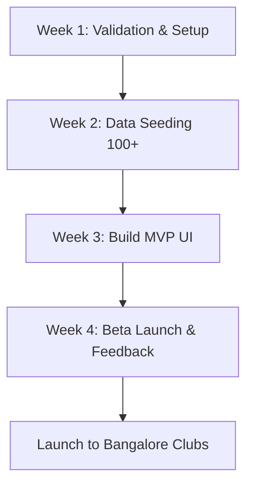

# 15. Final Recommendation

---

## Is This Worth Building?

**YES. Absolutely.**

The sports event ecosystem in India is experiencing a structural boom driven by increasing disposable income, corporate wellness mandates, and a massive cultural shift toward running, cycling, and outdoor fitness. 

However, the discovery layer is completely broken and trapped in fragmented, unsearchable silos (Instagram stories, closed WhatsApp groups, obsolete web directories). By building a clean, modern, multi-sport, discovery-first utility, you can capture the high-intent entry point of this high-spending demographic.

---

## Is it Venture-Scale?

**Yes, but not as a pure directory listing website.**

If the platform remains only a calendar directory, it is a lifestyle business. To make it venture-scale, it must execute the following evolution:
1. **Wedge**: Free, comprehensive event aggregator + planning tools (India-first).
2. **Moat**: Complete event database + organizer claims + verified review ecosystem + direct WhatsApp integration.
3. **Scale (Expansion)**: Expand globally to Southeast Asia and Middle East (countries with similar fragmentation patterns).
4. **Platform Monetization**:
   - **Organizer SaaS**: Marketing automation, CRM tools, WhatsApp/Instagram campaign planners, participant communications.
   - **Sponsorship & Ad Network**: Brands (Decathlon, Nike, Asics, Garmin) targeting highly active athletes contextually.
   - **Subscription Premium**: Advanced athlete planning features, training calendar sync, custom challenges.
   - **Ecosystem APIs**: Licensing event calendars and athlete preference data to tracking apps (Strava, Garmin Connect) or corporate fitness programs.

---

## The Best Wedge

**Complete, Localized Event Aggregation in Bangalore.**

Do not build a social feed or native app first. Do not try to launch across all of India. 
Seed every running, cycling, and trekking event in Bangalore. Make the data 100% complete. Ensure that if an event exists, it is on the site. Give users a fast, filter-first web interface that works flawlessly on mobile, and let them share event info on WhatsApp in one click.

---

## The Biggest Risk

**The Cold Start: The empty database problem combined with low search density during the off-season.**

If users visit and find 10 events, they leave and never return. Aggregating data manually is boring, unglamorous work. The team must be committed to listing events proactively before automation is built.

---

## Best Next Steps (Next 30 Days)

### Week 1: Foundation & Validation
- Conduct 15 athlete interviews and 5 organizer interviews (Bangalore).
- Set up domain, hosting, and repository.
- Verify initial database schema (PostgreSQL or SQLite to start).

### Week 2: Manual Event Seeding
- Manually collect 150 running, cycling, and trekking events in Bangalore, Mumbai, Pune.
- Enter them into a staging database or Google Sheets to verify database schema requirements.

### Week 3: Build Core MVP
- Develop the Next.js frontend (filtered event grid, event detail pages, search bar).
- Implement responsive styles and basic SEO optimizations (meta tags, sitemaps).

### Week 4: Beta Rollout
- Soft launch to 3-5 local running/cycling clubs in Bangalore.
- Collect usability feedback and track registration link clicks.
