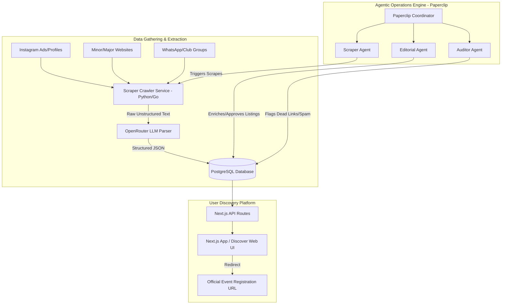

# System Patterns: GoAthletix

## System Architecture

## Key Architectural Patterns
- **Extraction Pipeline**: Use LLMs (via OpenRouter) as parser function calls. Instead of writing custom regex parser logic for 100+ different websites, scrapers pass raw HTML/text payloads to an LLM to output a standard Event JSON.
- **Verification Gate**: Scraped data is marked as `draft` or `unverified` in PostgreSQL. An editorial agent (manual or automated Agent) reviews the details before promoting to `published`.
- **Redirects Only**: Registration button does not trigger checkouts. It opens a clean outer redirect page with tracking (`/register?event_id=XYZ`) that links to the official page.
