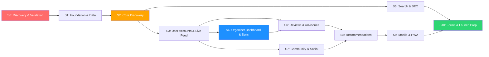

# 🏗️ GoAthletix — 10-Sprint Development Roadmap

> **Product**: Sports Event Discovery Platform for India
> **Type**: Discovery-first (NOT ticketing/payments)
> **Sports Coverage**: Running, Cycling, Triathlons, Treks, Adventure Sports, Fitness Events, Community Sports
> **Organizer Tools**: WhatsApp & Instagram Integration
> **Sprint Cadence**: 2-week sprints (10 working days each)
> **Team Assumption**: 2 FE, 2 BE, 1 Mobile/PWA, 1 Designer, 1 PM, 0.5 QA
> **Timeline**: Sprint 0 starts Week 1 → Sprint 10 ends Week 22 (~5.5 months)

---

## Table of Contents

1. [Sprint 0: Discovery & Validation](#sprint-0-discovery--validation)
2. [Sprint 1: Foundation & Data Layer](#sprint-1-foundation--data-layer)
3. [Sprint 2: Core Discovery Experience](#sprint-2-core-discovery-experience)
4. [Sprint 3: User Accounts & Live Activity Feed (WebSockets)](#sprint-3-user-accounts--live-activity-feed-websockets)
5. [Sprint 4: Organizer Dashboard v1 & Buddy Sync](#sprint-4-organizer-dashboard-v1--buddy-sync)
6. [Sprint 5: Search, SEO & Content](#sprint-5-search-seo--content)
7. [Sprint 6: Reviews, Trust & Weather/Altitude Advisories](#sprint-6-reviews-trust--weatheraltitude-advisories)
8. [Sprint 7: Community & Social v1](#sprint-7-community--social-v1)
9. [Sprint 8: Recommendations & Intelligence](#sprint-8-recommendations-intelligence)
10. [Sprint 9: Mobile Optimization & PWA](#sprint-9-mobile-optimization--pwa)
11. [Sprint 10: Feedback, Event Request Forms & Launch Prep](#sprint-10-feedback-event-request-forms--launch-prep)
12. [GANTT Summary](#gantt-style-summary)
13. [Dependency Map](#cross-sprint-dependency-map)
14. [Risk Register](#cumulative-risk-register)

---

## Sprint 0: Discovery & Validation

| Attribute | Detail |
|---|---|
| **Sprint Goal** | Validate core assumptions about user needs, organizer willingness, and data availability before writing a single line of production code. Kill bad ideas early. |
| **Duration** | 2 weeks (Days 1–14) |
| **Features** | • Conduct 15+ user interviews (runners, cyclists, trek organizers, fitness coaches) across Bangalore, Mumbai, NCR • Map the current "event discovery journey" for 3 user personas (Weekend Warrior, Serious Amateur, Event Organizer) • Audit 50+ existing event sources (Instagram pages, WhatsApp groups, Townscript listings, Bhaago India, India Running, club websites) • Build a manual event spreadsheet with 200+ real events to validate the data schema • Test a "fake door" landing page with Google Ads in Bangalore to measure intent (target: 5%+ signup rate) • Define the MVP event data schema (fields, taxonomies, sport categories, location hierarchy) • Competitive teardown of Bhaago India, Townscript, LetsDoThis, Meetup — document exactly what's broken |
| **Design Deliverables** | • 3 user persona cards with validated pain points • User journey maps (current state vs. desired state) for each persona • Wireframe sketches (paper/Figma lo-fi) for the core discovery feed • Moodboard for visual identity (sporty, energetic, Indian-first) • Information architecture (IA) v1 — site map with 10–15 pages |
| **Engineering Deliverables** | • Tech stack decision document (recommended: Next.js + Supabase/PostgreSQL + Vercel) • Landing page deployed with analytics (Vercel + Plausible/PostHog) • Event data schema v1 (PostgreSQL DDL or Prisma schema) • CI/CD pipeline skeleton (GitHub Actions → Vercel preview deploys) • Development environment setup guide (README with `npm run dev` instructions) |
| **Risks** | • **User interviews biased toward enthusiasts** — mitigate by including 5+ casual/beginner athletes • **Organizers unwilling to share data** — mitigate by offering free event pages as incentive • **Schema over-engineering** — mitigate by starting with 15 fields max, expand later • **Fake door test inconclusive** — need minimum 500 ad impressions per city to get signal |
| **Exit Criteria** | ✅ 15+ user interviews completed and synthesized ✅ Event data schema finalized and reviewed by engineering ✅ Landing page live with 500+ visitors and signup rate measured ✅ Tech stack approved by team with ADR (Architecture Decision Record) ✅ Go/No-Go decision documented based on validation signals |
| **KPIs** | • Landing page signup conversion rate (target: ≥5%) • Number of user interviews completed (target: ≥15) • Number of real events catalogued in spreadsheet (target: ≥200) • Number of organizers who expressed interest in listing (target: ≥10) • Team confidence score on 1–5 scale (target: ≥4) |

---

## Sprint 1: Foundation & Data Layer

| Attribute | Detail |
|---|---|
| **Sprint Goal** | Build the production database, API layer, and admin tools to ingest, store, and manage event data. No user-facing UI yet — this is plumbing. |
| **Duration** | 2 weeks (Days 15–28) |
| **Features** | • Production database with event schema (events, locations, sports categories, organizers, images) • RESTful API for CRUD operations on events (`/api/events`, `/api/categories`, `/api/locations`) • Admin dashboard for manual event entry and bulk CSV import • Location hierarchy: Country → State → City → Area (India-specific: Koramangala, Powai, Connaught Place, etc.) • Sport taxonomy: 6 top-level categories (Running, Cycling, Triathlon, Trekking, Adventure, Fitness) with 25+ subcategories • Image upload and optimization pipeline (WebP conversion, responsive sizes) • Basic event scraper v0.1 for 2–3 public sources (Instagram public pages, specific event websites) |
| **Design Deliverables** | • Design system v1: color palette, typography (Inter/Outfit), spacing scale, component tokens • Admin dashboard UI (functional, not pretty — internal tool) • Event card component design (3 variants: compact, standard, featured) • Icon set selection (sport-specific icons for 6 categories) • Responsive grid system definition (mobile-first breakpoints) |
| **Engineering Deliverables** | • PostgreSQL schema deployed (Supabase or managed Postgres) • Next.js API routes with input validation (Zod) • Prisma ORM models with migrations • Admin dashboard (Next.js pages, protected by basic auth) • CSV bulk import tool (parse, validate, insert) • Image upload to Cloudinary/S3 with automatic optimization • Seed script with 200+ real events from Sprint 0 spreadsheet • API documentation (Swagger/OpenAPI auto-generated) • Rate limiting and basic API security headers |
| **Risks** | • **Schema migrations become painful later** — mitigate with Prisma migrate and strict versioning • **Scraper breaks on source changes** — accept this; scrapers are supplementary, not primary • **Location data inconsistency** — mitigate with Google Places API for geocoding + manual override • **Scope creep on admin dashboard** — keep it ugly but functional; it's an internal tool |
| **Exit Criteria** | ✅ 200+ real events seeded into production database ✅ API endpoints return correct data with <200ms p95 latency ✅ Admin can create, edit, and delete events through dashboard ✅ CSV import successfully processes 100+ events in one batch ✅ Image pipeline produces 3 responsive sizes for each upload ✅ All API routes have input validation and error handling |
| **KPIs** | • API p95 latency (target: <200ms) • Database query performance on event listing (target: <50ms for 1000 events) • Number of events in production DB (target: ≥200) • Admin task completion time: create event (target: <3 min) • Zero critical bugs in API layer |

---

## Sprint 2: Core Discovery Experience

| Attribute | Detail |
|---|---|
| **Sprint Goal** | Ship the user-facing discovery feed — the single most important page. Users can browse, filter, and view events. This is the "moment of truth" for the product. |
| **Duration** | 2 weeks (Days 29–42) |
| **Features** | • Homepage with curated event feed (upcoming events, sorted by date and relevance) • Filter bar: Sport type, City, Date range, Distance/Difficulty, Free/Paid, Indoor/Outdoor • Event detail page with: title, date, location (map), sport type, difficulty, distance, organizer info, description, images, registration link (external) • City-specific landing pages (e.g., `/bangalore/running`, `/mumbai/cycling`) • "Happening This Weekend" section on homepage • "Near You" section using browser geolocation (with graceful fallback to city selection) • Event card interactions: hover effects, quick-view modal • Empty states and loading skeletons for all data states • Mobile-responsive layout (80%+ of Indian users are mobile-first) |
| **Design Deliverables** | • Homepage high-fidelity mockup (mobile + desktop) • Event detail page design (mobile + desktop) • Filter bar component (collapsible on mobile, sidebar on desktop) • Event card final designs (3 variants with real data) • Map integration design (embedded Google Maps with event pin) • Empty state illustrations (no events found, no events in city) • Loading skeleton designs • Typography and content guidelines for event descriptions |
| **Engineering Deliverables** | • Homepage with SSR (Next.js `getServerSideProps` or App Router server components) • Event listing API with pagination, filtering, sorting • Event detail page with dynamic routing (`/events/[slug]`) • City landing pages with ISR (Incremental Static Regeneration) • Filter system: URL-based state (shareable filtered views) • Google Maps embed on event detail page • Browser geolocation API integration with city fallback • Image lazy loading with blur placeholder • Core Web Vitals optimization (LCP <2.5s, CLS <0.1) • Error boundaries and 404 page |
| **Risks** | • **Discovery feed feels empty with only 200 events** — mitigate by focusing on 2–3 cities initially and curating quality over quantity • **Filter combinations return zero results** — mitigate with smart empty states that suggest broadening filters • **Geolocation permission denied by users** — mitigate with manual city selector as default • **Mobile performance on low-end Android** — mitigate by testing on Moto G4 / Redmi Note class devices • **External registration links break** — accept this; we don't control external URLs |
| **Exit Criteria** | ✅ Homepage loads in <3s on 3G connection (Lighthouse mobile score ≥70) ✅ Users can filter events by sport, city, date with URL persistence ✅ Event detail page renders with all fields, map, and external registration link ✅ Mobile layout passes visual QA on 5+ Android devices ✅ 3 city landing pages live (Bangalore, Mumbai, NCR) ✅ Zero layout shifts (CLS <0.1) on homepage |
| **KPIs** | • Lighthouse mobile performance score (target: ≥70) • Time to first meaningful paint (target: <2s) • Events per filter combination returning results (target: ≥80% of common combos) • User session duration on discovery feed (target: ≥90s) • Event detail page click-through rate from feed (target: ≥15%) • Bounce rate on homepage (target: <60%) |

---

## Sprint 3: User Accounts & Live Activity Feed (WebSockets)

| Attribute | Detail |
|---|---|
| **Sprint Goal** | Enable user identity and build a live-updating interactive feed using WebSockets to allow users to save events, view community updates in real-time, and plan calendars together. |
| **Duration** | 2 weeks (Days 43–56) |
| **Features** | • Authentication: Google OAuth + Phone OTP (Indian users prefer phone auth) • User profile page: name, city, sport preferences, experience level • "Save Event" / "Wishlist" functionality (heart icon on event cards) • "My Events" dashboard showing saved events grouped by date • Event reminders via email (7 days before, 1 day before) • "Share Event" button (WhatsApp deep link, Instagram Stories share, copy link) • Sport preference onboarding flow (select 3+ sports during signup) • Calendar view of saved events (monthly view) • "I'm Going" status on events (public, opt-in) • **Live Activity Feed**: Real-time event updates (signups, event saves, newly added listings) broadcasted using WebSockets to drive community urgency and engagement |
| **Design Deliverables** | • Login/Signup flow (Google OAuth + Phone OTP screens) • Onboarding flow: sport preference selection (interactive, fun) • User profile page design • "My Events" dashboard design (list view + calendar view) • Save/Wishlist interaction design (micro-animation on heart icon) • Share sheet design (WhatsApp, Instagram, Copy Link) • Reminder notification templates (email) • **Live Activity Feed UI**: High-fidelity dashboard sidebar, notification toasts, and activity feed layouts featuring real-time animation of active signups/saves |
| **Engineering Deliverables** | • NextAuth.js or Supabase Auth with Google + Phone OTP providers • User profile CRUD API (`/api/users/[id]`) • Saved events API (`/api/users/[id]/saved-events`) • Event reminder system (cron job or Supabase edge function) • Email service integration (Resend or SendGrid) for reminders • WhatsApp share deep link generation (`wa.me` with pre-filled text) • Instagram Stories share (Open Graph meta tags for rich preview) • Protected routes middleware (redirect unauthenticated users) • User preferences stored in database with sport affinity scores • GDPR-lite: user data export and account deletion • **WebSocket server setup**: Setup WebSocket server endpoints (using Supabase Realtime, Socket.io, or AWS API Gateway WebSockets) for streaming event activities to browsers • **WebSocket client listener**: Real-time broadcast listener integrated with client browser feed |
| **Risks** | • **Phone OTP costs escalate** — mitigate by rate-limiting OTP requests (max 3/hour) and using Twilio/MSG91 bulk plans • **Low signup conversion** — mitigate by allowing browse-without-login; only gate save/plan features • **WhatsApp share attribution is impossible** — accept this; WhatsApp is a black box for analytics • **Calendar view complexity** — mitigate by shipping list view first, calendar as enhancement • **Email deliverability issues** — mitigate by using authenticated domain (SPF/DKIM/DMARC) • **WebSocket connection stability & scaling under load** — mitigate by using Redis adapters, implementing heartbeat ping-pong, and client reconnection logic with exponential backoff |
| **Exit Criteria** | ✅ Users can sign up via Google OAuth and Phone OTP ✅ Save event works and persists across sessions ✅ "My Events" page shows saved events with correct dates ✅ Event reminders fire at correct times (tested with 3+ test events) ✅ WhatsApp share generates correct deep link with event details ✅ Onboarding flow captures sport preferences for ≥80% of signups ✅ WebSocket connections successfully broadcast signups and saves to other connected clients in <150ms |
| **KPIs** | • Signup conversion rate from browse to account (target: ≥8%) • % of users who save ≥1 event in first session (target: ≥20%) • Onboarding completion rate (target: ≥75%) • Share button usage per session (target: ≥5% of sessions) • Reminder email open rate (target: ≥30%) • Phone OTP success rate (target: ≥95%) • WebSocket connection availability/uptime (target: ≥99.9%) • Live feed message broadcast latency (target: <150ms) |

---

## Sprint 4: Organizer Dashboard v1 & Buddy Sync

| Attribute | Detail |
|---|---|
| **Sprint Goal** | Build the initial organizer management dashboard and supply-side ingestion funnel, and integrate Buddy Sync social matching to enable viral user loops and event alignment. |
| **Duration** | 2 weeks (Days 57–70) |
| **Features** | • Organizer registration and verification flow (basic: name, organization, website/social link) • Event creation form: multi-step wizard (details → logistics → media → preview → publish) • **Organizer dashboard v1**: Central workspace to track performance stats (views, saves, shares), edit listings, duplicate recurring races, and manage profile information • WhatsApp integration v1: Auto-generate a WhatsApp message template with event link, image, and key details — one-tap share to WhatsApp groups/status • Instagram integration v1: Auto-generate an Instagram-ready image card (1080x1080) with event name, date, location, sport type — downloadable as PNG • Organizer profile page (public): organization name, bio, past events, upcoming events, follower count • "Claim this event" flow for events added by the platform team • Organizer notification: new saves, new "I'm Going" RSVPs • Bulk event creation (CSV upload for organizers with recurring events) • **Buddy Sync integration**: Shareable custom sync links allowing users to invite sport buddies, align calendars, plan race schedules together, and drive organic network effect |
| **Design Deliverables** | • Event creation wizard (5-step flow, mobile-optimized) • **Organizer dashboard v1 layout**: Responsive design with analytics widgets, activity feeds, and listed events list • Instagram card template system (3 sport-themed templates: running, cycling, general) • WhatsApp message preview component • Organizer profile page design • "Claim Event" flow design • Notification center design (in-app + email) • **Buddy Sync UI components**: Dynamic calendar comparison view showing overlaps/gaps, invitation landing page, and sync status widgets |
| **Engineering Deliverables** | • Organizer role and permissions system (RBAC: user, organizer, admin) • Multi-step event creation API with draft/published states • Image card generator service (Canvas API or Puppeteer for server-side rendering of Instagram templates) • WhatsApp deep link generator with UTM parameters • Organizer analytics API (event views, saves, shares — aggregated from existing data) • "Claim Event" verification queue (admin approval workflow) • Organizer notification system (email + in-app) • Event duplication API (clone with date shift) • Rich text editor for event descriptions (Tiptap or similar) • Organizer onboarding email sequence (3-email drip) • **Buddy Sync APIs**: Database schema models for calendar sync entities, unique link generator (`/api/sync/[token]`), and side-by-side calendar comparison logic |
| **Risks** | • **Organizers won't use a web form** — mitigate by making WhatsApp-based event submission a v2 priority (accept form for now) • **Instagram template quality is low** — mitigate by using professional design templates, not auto-generated garbage • **Verification queue creates bottleneck** — mitigate by auto-approving organizers with verified social links; manual review for others • **Organizers expect ticketing/payments** — be explicit in messaging: "We're discovery, not ticketing. Link to your own registration." • **Low organizer adoption** — mitigate by personally onboarding 20 organizers during this sprint • **Buddy Sync calendar conflict rendering** — mitigate by keeping comparison interface purely visual, letting athletes discuss scheduling on their preferred chat apps |
| **Exit Criteria** | ✅ Organizer can create and publish an event in <5 minutes ✅ Instagram card generates correctly with event data (tested with 10 events) ✅ WhatsApp share includes event link, image preview, and key details ✅ Organizer dashboard v1 shows real-time view/save counts ✅ 20+ organizers onboarded and have published at least 1 event ✅ "Claim Event" flow works end-to-end with admin approval ✅ Buddy Sync link generator successfully creates shareable tokens that render a comparative calendar view for multiple users |
| **KPIs** | • Organizer signup rate (target: ≥20 in sprint) • Event creation completion rate (target: ≥70% of started events get published) • Average time to publish an event (target: <5 min) • Instagram card download rate (target: ≥50% of organizers download at least 1) • WhatsApp share usage by organizers (target: ≥60% use it at least once) • Organizer return rate within 2 weeks (target: ≥40%) • Buddy Sync links generated (target: ≥500 created links) • Invited buddies who create accounts via sync links (target: ≥20%) |

---

## Sprint 5: Search, SEO & Content

| Attribute | Detail |
|---|---|
| **Sprint Goal** | Make every event discoverable via Google Search and on-platform search. SEO is the primary organic acquisition channel — every event page must rank. Build a content layer that drives long-tail traffic. |
| **Duration** | 2 weeks (Days 71–84) |
| **Features** | • Full-text search with autocomplete (search by event name, city, sport, organizer) • SEO-optimized event pages: structured data (JSON-LD Event schema), meta tags, canonical URLs, Open Graph tags • Dynamic sitemap generation (XML sitemap updated on event publish) • City + Sport landing pages with editorial content (e.g., "Best Running Events in Bangalore 2026") • Blog/content section: "Event Guides" (e.g., "Your First Marathon: What to Expect", "Top 10 Cycling Routes Near Mumbai") • Search results page with relevant filters and sorting • "Did you mean?" and typo tolerance in search • Search analytics: track what users search for (for content strategy) • URL slugs for all entities (events, cities, sports) — human-readable, SEO-friendly |
| **Design Deliverables** | • Search bar component (desktop header + mobile overlay) • Search results page design (with filters sidebar/drawer) • Autocomplete dropdown design (recent searches, suggested events) • Blog/content page templates (article, listicle, guide) • City+Sport landing page template • "No results" search state with suggestions • Open Graph image template (auto-generated for social sharing) |
| **Engineering Deliverables** | • Full-text search engine (PostgreSQL `tsvector` for v1, Meilisearch/Typesense if scale demands) • Autocomplete API with debounced client-side calls • JSON-LD structured data for Event schema on all event pages • Dynamic XML sitemap generator (rebuild on event publish/update) • `robots.txt` and meta robots configuration • Open Graph meta tags with dynamic image generation (Vercel OG or `@vercel/og`) • Blog CMS integration (MDX files or headless CMS like Sanity/Contentful) • City+Sport landing page generation from database (ISR) • Search analytics table (log queries, click-through, zero-result queries) • Canonical URL strategy implementation • Google Search Console setup and sitemap submission |
| **Risks** | • **SEO takes 3–6 months to show results** — accept this; start now, measure later. Don't skip it because ROI is delayed. • **Search quality is poor with limited data** — mitigate with typo tolerance and synonym matching (run = running = marathon) • **Content creation bottleneck** — mitigate by writing 5 core articles in this sprint, not 50. Quality > quantity. • **Sitemap becomes stale** — mitigate with webhook-triggered regeneration on event publish • **Duplicate content across city pages** — mitigate with unique intro paragraphs per city page |
| **Exit Criteria** | ✅ Search returns relevant results for 90%+ of test queries (50 test queries) ✅ Every event page has valid JSON-LD Event structured data (tested with Google Rich Results Test) ✅ Sitemap is auto-generated and submitted to Google Search Console ✅ 3+ city/sport landing pages live with editorial content ✅ 5+ blog articles published ✅ Open Graph previews render correctly on WhatsApp, Twitter, LinkedIn |
| **KPIs** | • Search usage rate (target: ≥20% of sessions use search) • Search-to-click rate (target: ≥40% of searches result in event click) • Zero-result search rate (target: <15%) • Google Search Console: pages indexed (target: ≥80% of event pages) • Organic traffic after 30 days (baseline measurement — target: >0) • Blog article average read time (target: ≥2 min) |

---

## Sprint 6: Reviews, Trust & Weather/Altitude Advisories

| Attribute | Detail |
|---|---|
| **Sprint Goal** | Build trust signals through post-event reviews, ratings, and badges; and implement dynamic Weather & Altitude Advisories for high-altitude or extreme terrain races to enhance safety. |
| **Duration** | 2 weeks (Days 85–98) |
| **Features** | • Post-event review system: star rating (1–5) + text review + photo upload • Review prompts: automatic email/push 24 hours after event ends ("How was [Event Name]?") • Event quality score: composite score visible on event card (based on reviews, organizer history, event completeness) • "Verified Organizer" badge (criteria: 3+ events listed, 1+ reviews, verified identity) • "Repeat Event" badge (for events that have run 2+ editions) • Review moderation: profanity filter + admin review queue for flagged content • Organizer response to reviews (public reply capability) • Past event archive: completed events remain visible with reviews (not deleted) • Report/flag mechanism for events (spam, misleading, cancelled) • Event completeness score for organizers ("Your listing is 70% complete — add images to reach 100%") • **Weather & Altitude Advisories**: Dynamic weather forecasting (via OpenWeatherMap API) and safety recommendations for high-altitude or seasonal extreme weather (e.g. monsoons) on event page layouts |
| **Design Deliverables** | • Review submission form (star + text + photo, mobile-optimized) • Review display component (on event detail page, with organizer replies) • Quality score badge design (visual indicator on event cards) • "Verified Organizer" badge design (trustworthy but not overwrought) • Review prompt email template • Report/flag modal design • Past event archive page design • Event completeness progress bar for organizers • **Weather & Altitude Warning banners & widgets**: Displays temperature/humidity forecasts, elevation profiles, atmospheric density guidance, and monsoon/heat/altitude acclimatization advisories |
| **Engineering Deliverables** | • Reviews CRUD API (`/api/events/[id]/reviews`) • Review prompt scheduler (cron: 24h post-event-end, send email) • Quality score algorithm v1 (weighted: 40% reviews, 30% organizer history, 30% listing completeness) • Moderation pipeline: profanity filter (bad-words library) + admin queue • Verified Organizer status calculation (automated based on criteria) • Organizer reply API • Report/flag API with admin review workflow • Past events query filter (completed events with reviews) • Review photo upload and moderation • Anti-spam: rate limiting reviews (1 per user per event), duplicate detection • **OpenWeatherMap Integration**: API client integration for event location coordinates, caching mechanism (3 hours) to prevent rate limits • **Elevation and Altitude Advisory Engine**: Automatic calculation of elevation warning conditions (>1,500m) and terrain-specific risk logic database flags |
| **Risks** | • **No reviews in the beginning (cold start)** — mitigate by personally soliciting reviews from Sprint 0 interview participants and early users • **Fake reviews from organizers** — mitigate by requiring "I'm Going" or verified attendance for review eligibility • **Negative reviews scare organizers away** — mitigate with organizer reply feature and clear community guidelines • **Quality score feels arbitrary** — mitigate by being transparent about the algorithm ("Based on X reviews, Y events run") • **Moderation queue overwhelms small team** — mitigate with automated profanity filter handling 90% of cases • **Weather API outages or stale climate data** — mitigate by implementing cache fallbacks, displaying last-cached warnings, and placing clear disclaimers that real-time mountain weather varies |
| **Exit Criteria** | ✅ Users can submit reviews with star rating, text, and photos ✅ Review prompts fire correctly 24h after event end (tested with 5+ past events) ✅ Quality score displays on event cards and updates in real-time ✅ "Verified Organizer" badge appears for qualifying organizers ✅ Report/flag flow works end-to-end with admin notification ✅ Past events are archived and browsable (not deleted) ✅ Weather and elevation charts/warnings render correctly on dynamic event detail pages |
| **KPIs** | • Review submission rate post-prompt (target: ≥15% of prompted users submit) • Average review length (target: ≥50 words — indicates genuine engagement) • % of events with ≥1 review after 30 days (target: ≥20% of completed events) • False positive rate in moderation (target: <5%) • Organizer response rate to reviews (target: ≥30%) • Report/flag volume (monitor — no target, just track) • Percentage of high-altitude/extreme weather events featuring dynamic advisories (target: 100%) • Average load time of weather/altitude component (target: <40ms) |

---

## Sprint 7: Community & Social v1

| Attribute | Detail |
|---|---|
| **Sprint Goal** | Transform GoAthletix from a directory into a community. Users should be able to follow organizers, see what friends are attending, and discover events through social signals. This is the retention flywheel. |
| **Duration** | 2 weeks (Days 99–112) |
| **Features** | • Follow organizer: get notified when they post new events • "Friends Going" indicator on event cards (show avatars of followed users who are attending) • Activity feed: "People you follow are going to [Event Name]" • User-to-user follow system (opt-in, public profiles) • Group creation: "Bangalore Runners", "Mumbai Cycling Club" (user-created, open/invite-only) • Group event recommendations: events relevant to group members' interests • "Invite Friends" via WhatsApp (share app link with referral code) • Attendee count on event pages ("42 people interested") • Social proof notifications: "12 people saved this event in the last 24 hours" • Organizer follower milestones ("You've reached 100 followers!") |
| **Design Deliverables** | • Activity feed design (mobile-first, card-based) • Follow button component (organizer + user variants) • "Friends Going" avatar stack component • Group page design (cover image, members, events, discussion) • Group creation flow • "Invite Friends" share sheet with referral messaging • Social proof notification design (subtle, non-intrusive) • Follower milestone notification design |
| **Engineering Deliverables** | • Follow/unfollow API (`/api/users/[id]/following`) • Activity feed generation (fan-out-on-read for v1 — simple but sufficient at current scale) • Groups CRUD API (`/api/groups`) • Group membership management (join, leave, invite, admin roles) • "Friends Going" query (join saved events × following list) • Referral code generation and tracking • Social proof counters (real-time save counts via database triggers or polling) • Push notification infrastructure (web push via service worker) • Notification preferences API (email, push, in-app — per notification type) • Rate limiting on follow/unfollow to prevent spam |
| **Risks** | • **Social features feel empty with low user count** — mitigate by seeding groups (create 5 official groups for top cities/sports) • **Activity feed performance degrades** — mitigate by paginating and caching; fan-out-on-read is fine for <10K users • **Groups become ghost towns** — mitigate by tying groups to organizer accounts and populating with event-related content • **Referral spam** — mitigate by capping referral rewards (if any) and monitoring abuse • **Notification fatigue** — mitigate with sensible defaults (daily digest, not per-event) and easy mute |
| **Exit Criteria** | ✅ Users can follow organizers and receive new event notifications ✅ "Friends Going" shows correct data on event cards ✅ Activity feed renders with relevant social events ✅ Groups can be created, joined, and display relevant events ✅ WhatsApp invite generates tracked referral link ✅ Notification preferences are configurable per type |
| **KPIs** | • % of users who follow ≥1 organizer (target: ≥25% of registered users) • Activity feed engagement rate (target: ≥10% of sessions visit feed) • Groups created (target: ≥10 in first 2 weeks) • Referral invite-to-signup rate (target: ≥15%) • Notification opt-in rate (target: ≥60% keep push notifications on) • Average follows per user (target: ≥3) |

---

## Sprint 8: Recommendations & Intelligence

| Attribute | Detail |
|---|---|
| **Sprint Goal** | Move from manual discovery to personalized, intelligent event recommendations. Use user behavior, preferences, and collaborative filtering to surface the right events to the right users at the right time. |
| **Duration** | 2 weeks (Days 113–126) |
| **Features** | • "Recommended for You" section on homepage (personalized based on sport preferences, past saves, location) • "Because you saved [Event X]" contextual recommendations on event detail pages • "Trending in [City]" section (events with highest save/view velocity) • "New This Week" section (freshly listed events) • Email digest: weekly personalized event recommendations (Monday morning) • WhatsApp notification channel: opt-in weekly picks via WhatsApp Business API • Smart event ranking: events ranked by relevance score (not just date) • "Events like this" similarity engine (same sport, same city, similar difficulty) • User taste profile: inferred from saves, clicks, and dwell time (not just stated preferences) • Seasonal recommendations: "Monsoon Treks", "Winter Marathons", "Summer Cycling" |
| **Design Deliverables** | • "Recommended for You" section design (carousel or grid) • Contextual recommendation card ("Because you saved...") • "Trending" section design with trend indicators • Weekly digest email template (personalized, 5–7 events) • WhatsApp recommendation message template • Taste profile visualization (user-facing: "Your Sport DNA") • Seasonal recommendation banner design |
| **Engineering Deliverables** | • Recommendation engine v1: content-based filtering (sport, city, difficulty, date proximity) • Collaborative filtering v0.1: "users who saved X also saved Y" (basic co-occurrence matrix) • Relevance scoring algorithm (weighted: preference match, recency, popularity, proximity) • Event similarity API (`/api/events/[id]/similar`) • User behavior tracking: save, click, dwell time, search queries (event log table) • Weekly digest email pipeline (scheduled job, personalized event selection) • WhatsApp Business API integration for broadcast messages • Trending calculation: rolling 24h save/view velocity per event • A/B testing framework setup (Vercel edge middleware or PostHog feature flags) • Recommendation performance tracking (CTR on recommended events) |
| **Risks** | • **Cold start for new users** — mitigate with popularity-based defaults and sport preference onboarding from Sprint 3 • **Recommendation quality is poor with sparse data** — mitigate by starting with content-based filtering (deterministic, not ML); add collaborative filtering only when >1K users • **WhatsApp Business API approval delays** — apply early (Sprint 6–7); have email as fallback • **Over-personalization creates filter bubbles** — mitigate with "Explore" section showing events outside preferences • **Email digest goes to spam** — mitigate with warm-up and authenticated sending domain |
| **Exit Criteria** | ✅ "Recommended for You" shows ≥5 events different from the default feed for users with preferences ✅ "Events like this" returns ≥3 relevant events per event page ✅ Trending section updates hourly and reflects actual save/view velocity ✅ Weekly digest email sends to all opted-in users on Monday ✅ A/B testing framework is operational (can split traffic on recommendation algorithms) ✅ Recommendation CTR is measurable and dashboarded |
| **KPIs** | • Recommendation click-through rate (target: ≥10% — higher than non-personalized feed) • Weekly digest email open rate (target: ≥25%) • Weekly digest click-through rate (target: ≥8%) • WhatsApp message delivery rate (target: ≥90%) • % of homepage events that are personalized vs. generic (target: ≥50% for returning users) • User retention lift for users who engage with recommendations (target: measurable positive delta) |

---

## Sprint 9: Mobile Optimization & PWA

| Attribute | Detail |
|---|---|
| **Sprint Goal** | Make GoAthletix feel native on mobile. 80%+ of Indian users access the web on mobile — the experience must be fast, installable, and work offline. Ship a PWA that competes with native apps. |
| **Duration** | 2 weeks (Days 127–140) |
| **Features** | • Progressive Web App (PWA) with install prompt ("Add to Home Screen") • Offline support: cached homepage, saved events viewable offline, offline event detail pages • Push notifications (web push): new events, reminders, social activity • App-like navigation: bottom tab bar (Discover, Search, Saved, Profile) • Touch-optimized interactions: swipe to save, pull to refresh, haptic feedback • Optimized image loading: AVIF/WebP with responsive `srcset`, aggressive lazy loading • Dark mode support (auto-detect system preference + manual toggle) • Performance budget enforcement: JS bundle <150KB gzipped, total page weight <500KB • Splash screen and app icon for PWA • Deep linking: `/events/[slug]` opens directly to event in PWA • Share target: PWA appears in OS share sheet for receiving shared content |
| **Design Deliverables** | • Mobile navigation redesign: bottom tab bar with 4–5 tabs • Dark mode color palette and component variants • PWA splash screen and app icon (512x512, 192x192) • Touch interaction specifications (swipe gestures, pull to refresh) • Offline state design (cached content indicators, "You're offline" banner) • Install prompt design (custom, not browser default) • Performance budget visualization (for engineering reference) |
| **Engineering Deliverables** | • Service worker with Workbox (precache app shell, runtime cache API responses) • PWA manifest (`manifest.json` with icons, theme color, display: standalone) • Offline fallback page and cached event detail pages • Web push notification infrastructure (VAPID keys, subscription management) • Bottom tab bar navigation component (client-side routing) • Dark mode CSS custom properties + system preference detection • Image optimization pipeline: AVIF/WebP with `<picture>` element and `srcset` • Bundle analysis and code splitting optimization • Lighthouse CI integration (fail build if mobile score <80) • Deep link handling in service worker • Share Target API registration in manifest • Performance monitoring: Real User Metrics (RUM) via web-vitals library |
| **Risks** | • **Service worker caching causes stale data** — mitigate with stale-while-revalidate strategy and cache versioning • **PWA install prompt is ignored by users** — mitigate with custom install prompt at the right moment (after 3+ sessions) • **Push notification permission denied** — mitigate by asking at the right context (not on first visit) • **Dark mode introduces visual bugs** — mitigate with systematic CSS custom property implementation and visual regression tests • **Older Android WebView doesn't support PWA features** — mitigate with progressive enhancement; core functionality works without service worker |
| **Exit Criteria** | ✅ PWA installable on Android Chrome and scores ≥90 on Lighthouse PWA audit ✅ Saved events viewable offline (tested in airplane mode) ✅ Push notifications deliverable to subscribed users ✅ Dark mode works across all pages without visual regressions ✅ Mobile Lighthouse performance score ≥80 ✅ JS bundle <150KB gzipped (measured via build output) ✅ Bottom tab navigation works with correct route highlighting |
| **KPIs** | • PWA install rate (target: ≥5% of mobile users install within 30 days) • Lighthouse mobile performance score (target: ≥80) • Push notification opt-in rate (target: ≥30%) • Offline page load success rate (target: 100% for cached pages) • JS bundle size (target: <150KB gzipped) • Time to Interactive on 3G (target: <5s) • Dark mode adoption rate (target: ≥20% of users) |

---

## Sprint 10: Feedback, Event Request Forms & Launch Prep

| Attribute | Detail |
|---|---|
| **Sprint Goal** | Build feedback & request loops, complete the comprehensive launch readiness checks, and prepare marketing and operations for public launch. |
| **Duration** | 2 weeks (Days 141–154) |
| **Features** | • Analytics dashboard for internal team: DAU, WAU, MAU, event views, saves, shares, signups, organizer metrics • Organizer analytics v2: detailed event performance (views over time, save rate, share channel breakdown, geographic distribution of interest) • Referral program: users invite friends → earn "GoAthletix Credits" (future use for premium features) • SEO performance dashboard: indexed pages, top queries, impressions, CTR from Google Search Console API • Error monitoring and alerting (Sentry or similar) • Uptime monitoring and status page • Load testing: simulate 1000 concurrent users (k6 or Artillery) • Database performance audit: slow query log analysis, index optimization • Security audit: OWASP top 10 checklist, dependency vulnerability scan • Legal/compliance: Privacy Policy, Terms of Service, Cookie consent banner • **Feedback & Event Request Forms**: User-facing interfaces to report issues, suggest platform improvements, or manually request listing support for unindexed events • **Launch checklist**: Automated checklist implementation validating DNS, SSL, database pool limits, CDN routing, and key backend endpoints before opening to the public • Organizer acquisition campaign: email/WhatsApp outreach to 200+ organizers • User acquisition campaign: Google Ads, Instagram Reels, running club partnerships |
| **Design Deliverables** | • Internal analytics dashboard mockup (team-facing, not user-facing) • Organizer analytics v2 page design (charts, trends, comparisons) • Referral program UI (invite card, credits balance, referral history) • Legal pages design (Privacy Policy, Terms — clean, readable) • Cookie consent banner design (GDPR-compliant, non-intrusive) • Launch social media assets (Instagram posts, LinkedIn banners, Product Hunt gallery) • Press kit: logo, screenshots, one-pager, founder quotes • **Feedback & Event Request forms**: Simple, low-friction modal overlays with form fields (name, email, feedback category, description, and dynamic event details) |
| **Engineering Deliverables** | • Analytics event tracking: PostHog or Mixpanel integration with 30+ tracked events • Internal metrics dashboard (Metabase or custom Next.js admin page) • Google Search Console API integration for SEO dashboard • Sentry error monitoring with source maps • Uptime monitoring (BetterUptime or UptimeRobot) with Slack alerts • Load testing scripts (k6) simulating peak traffic scenarios • Database indexing optimization based on slow query analysis • `npm audit` and Snyk vulnerability scan (fix critical/high) • Rate limiting on all public APIs (prevent abuse on launch day) • CDN configuration verification (Vercel Edge or Cloudflare) • Legal pages (static MDX content) • Cookie consent implementation (cookie banner + localStorage flag) • Referral code system with tracking and credit ledger • Feature flag cleanup: remove development flags, finalize A/B tests • Production environment hardening: env var audit, secret rotation • **Feedback & Event Request APIs**: Endpoint endpoints (`/api/feedback`, `/api/event-request`) storing data in DB with admin slack/email notification integrations • **Automated checklist validator**: Script running synthetic checks against APIs, DB pool, and WebSockets |
| **Risks** | • **Launch traffic spike crashes the app** — mitigate with load testing + Vercel auto-scaling (serverless advantage) • **Analytics implementation has tracking gaps** — mitigate with a tracking plan document reviewed before implementation • **Security vulnerabilities discovered late** — mitigate by running OWASP checks in Sprint 9 and fixing in Sprint 10 • **Organizer outreach has low response rate** — mitigate by offering "Founding Organizer" badge with premium visibility • **Product Hunt launch timing is bad** — mitigate by scheduling for Tuesday/Wednesday and preparing 2 weeks in advance • **Legal compliance gaps** — mitigate by consulting with legal advisor before launch • **Request/feedback form spam** — mitigate by integrating reCAPTCHA v3 or Cloudflare Turnstile on submission endpoints |
| **Exit Criteria** | ✅ Analytics tracks 30+ events accurately across the user journey ✅ Internal dashboard shows DAU, WAU, MAU, and top-line metrics ✅ Load test passes: 1000 concurrent users with <500ms p95 latency ✅ Zero critical/high security vulnerabilities (Snyk scan clean) ✅ Privacy Policy and Terms of Service published ✅ Error monitoring active with Slack alerts for P0/P1 errors ✅ 200+ organizers contacted; 50+ have active listings ✅ **Launch checklist script passes all checks** (DNS, database, SSL, APIs green) ✅ Feedback and Event Request forms work end-to-end and store logs |
| **KPIs** | • Analytics coverage: % of key user actions tracked (target: 100% of defined 30 events) • Load test p95 latency (target: <500ms at 1000 concurrent users) • Security scan results (target: 0 critical, 0 high vulnerabilities) • Organizers with active listings at launch (target: ≥50) • Total events listed at launch (target: ≥500) • Launch day uptime (target: 100%) • Week 1 post-launch DAU (target: ≥500) • Product Hunt upvotes on launch day (target: ≥100) • Average response time to feedback/event request submissions (target: <24 hours) • Automated checklist pass rate (target: 100%) |

---

## GANTT-Style Summary

> **Timeline**: 22 weeks (5.5 months) from Sprint 0 kick-off to launch readiness

| Sprint | Name | Weeks | W1–2 | W3–4 | W5–6 | W7–8 | W9–10 | W11–12 | W13–14 | W15–16 | W17–18 | W19–20 | W21–22 |
|--------|------|-------|------|------|------|------|-------|--------|--------|--------|--------|--------|--------|
| **S0** | Discovery & Validation | W1–2 | ████ | | | | | | | | | | |
| **S1** | Foundation & Data Layer | W3–4 | | ████ | | | | | | | | | |
| **S2** | Core Discovery Experience | W5–6 | | | ████ | | | | | | | | |
| **S3** | User Accounts & Live Activity Feed | W7–8 | | | | ████ | | | | | | | |
| **S4** | Organizer Dashboard v1 & Buddy Sync | W9–10 | | | | | ████ | | | | | | |
| **S5** | Search, SEO & Content | W11–12 | | | | | | ████ | | | | | |
| **S6** | Reviews, Trust & Advisories | W13–14 | | | | | | | ████ | | | | |
| **S7** | Community & Social v1 | W15–16 | | | | | | | | ████ | | | |
| **S8** | Recommendations & Intelligence | W17–18 | | | | | | | | | ████ | | |
| **S9** | Mobile Optimization & PWA | W19–20 | | | | | | | | | | ████ | |
| **S10** | Feedback, Request Forms & Launch Prep | W21–22 | | | | | | | | | | | ████ |

### Milestone Summary

| Milestone | Sprint | Week | Deliverable |
|-----------|--------|------|-------------|
| 🔬 Validation Complete | S0 | W2 | Go/No-Go decision with data |
| 🗄️ Data Layer Ready | S1 | W4 | 200+ events in production DB |
| 🚀 Alpha Launch (Internal) | S2 | W6 | Users can browse and discover events |
| 👤 Accounts & Live Feed | S3 | W8 | User accounts, WebSocket Live Activity Feed |
| 📋 Organizer Dashboard v1 | S4 | W10 | Dashboard v1, Buddy Sync calendar integration |
| 🔍 SEO Foundation | S5 | W12 | Google indexing, search, content layer |
| ⭐ Trust & Advisories | S6 | W14 | Reviews, ratings, weather/altitude advisories |
| 👥 Community Features | S7 | W16 | Social graph, groups, activity feed |
| 🧠 Smart Discovery | S8 | W18 | Personalized recommendations live |
| 📱 PWA Ready | S9 | W20 | Installable, offline-capable, dark mode |
| 🎯 Public Launch Ready | S10 | W22 | Forms (feedback/requests), launch checklist verified |

---

## Cross-Sprint Dependency Map

### Critical Path

**S0 → S1 → S2 → S3 → S4 → S6 → S8 → S9 → S10**

The critical path runs through data foundation → discovery → accounts → organizer tools → trust → intelligence → mobile → launch. Any delay on this path delays launch.

### Parallelization Opportunities

| Parallel Track | Can Run Alongside | Notes |
|---|---|---|
| SEO & Content (S5) | Organizer Tools (S4) | SEO work is independent once S2 (discovery pages) ships |
| Blog content writing | Any sprint after S5 starts | Content creation is non-engineering work |
| Organizer outreach | S4 onwards | Sales/BD work runs parallel to engineering |
| Design for S(n+1) | Engineering for S(n) | Designer works 1 sprint ahead of engineering |
| WhatsApp Business API approval | S6–S7 | Application process takes 2–4 weeks |

---

## Cumulative Risk Register

| ID | Risk | Severity | Probability | Sprint | Mitigation |
|----|------|----------|-------------|--------|------------|
| R1 | Event data quality is poor at launch | 🔴 High | High | S0–S1 | Manual curation for first 300 events; quality checklist per event |
| R2 | Organizers don't adopt self-serve tools | 🔴 High | Medium | S4 | White-glove onboarding for first 20 organizers; iterate on feedback |
| R3 | Mobile performance on low-end Android | 🟡 Medium | High | S2, S9 | Test on Moto G4 class devices; enforce performance budgets |
| R4 | SEO takes too long to show results | 🟡 Medium | High | S5 | Start early; combine with paid acquisition for initial traffic |
| R5 | Cold start: no reviews, no social proof | 🟡 Medium | High | S6–S7 | Seed reviews from beta users; create official community groups |
| R6 | WhatsApp Business API approval delayed | 🟡 Medium | Medium | S8 | Apply in S6; use WhatsApp deep links as fallback |
| R7 | User registration conversion is low | 🟡 Medium | Medium | S3 | Allow full browse without login; gate only save/plan features |
| R8 | Recommendation quality insufficient | 🟡 Medium | Medium | S8 | Start with simple content-based filtering; add ML later with more data |
| R9 | Launch day traffic spike crashes app | 🟡 Medium | Low | S10 | Load test to 2x expected peak; serverless architecture auto-scales |
| R10 | Team burnout on aggressive timeline | 🔴 High | Medium | All | Strict 2-week sprints with no scope creep; cut features, not corners |

---

## Sprint Capacity Planning

| Sprint | Design Load | Frontend Load | Backend Load | Key Bottleneck |
|--------|-------------|---------------|--------------|----------------|
| S0 | 🟢 Low | 🟢 Low | 🟢 Low | User research coordination |
| S1 | 🟡 Medium | 🟢 Low | 🔴 High | Database schema design decisions |
| S2 | 🔴 High | 🔴 High | 🟡 Medium | Design↔Frontend coordination |
| S3 | 🟡 Medium | 🔴 High | 🔴 High | Auth provider & WebSocket scaling/reconnection |
| S4 | 🔴 High | 🔴 High | 🔴 High | Dashboard panels & Buddy Sync calendar logic |
| S5 | 🟡 Medium | 🟡 Medium | 🔴 High | Search engine + SEO implementation |
| S6 | 🟡 Medium | 🟡 Medium | 🟡 Medium | Reviews & Weather/Altitude advisories caching |
| S7 | 🟡 Medium | 🔴 High | 🔴 High | Real-time social features |
| S8 | 🟢 Low | 🟡 Medium | 🔴 High | Recommendation algorithm |
| S9 | 🟡 Medium | 🔴 High | 🟢 Low | PWA/service worker complexity |
| S10 | 🟡 Medium | 🟡 Medium | 🟡 Medium | Launch checklist automation & form spam prevention |

---

## Success Criteria at Launch (End of Sprint 10)

| Metric | Target | Measurement Method |
|--------|--------|--------------------|
| Total events listed | ≥500 | Database count |
| Active organizers | ≥50 | Organizers with ≥1 published event |
| Cities covered | ≥5 | Bangalore, Mumbai, NCR, Pune, Hyderabad |
| Sports categories active | ≥6 | Running, Cycling, Triathlon, Trekking, Adventure, Fitness |
| Registered users (pre-launch beta) | ≥500 | Auth provider count |
| Lighthouse mobile score | ≥80 | Lighthouse CI |
| Event pages indexed by Google | ≥80% | Google Search Console |
| PWA installable | ✅ Yes | Lighthouse PWA audit |
| Uptime SLA | ≥99.5% | Uptime monitoring |
| P0 bugs at launch | 0 | Bug tracker |

---

*Last updated: July 2026*
*Document owner: Product Team*
*Review cadence: Sprint retro (every 2 weeks)*
