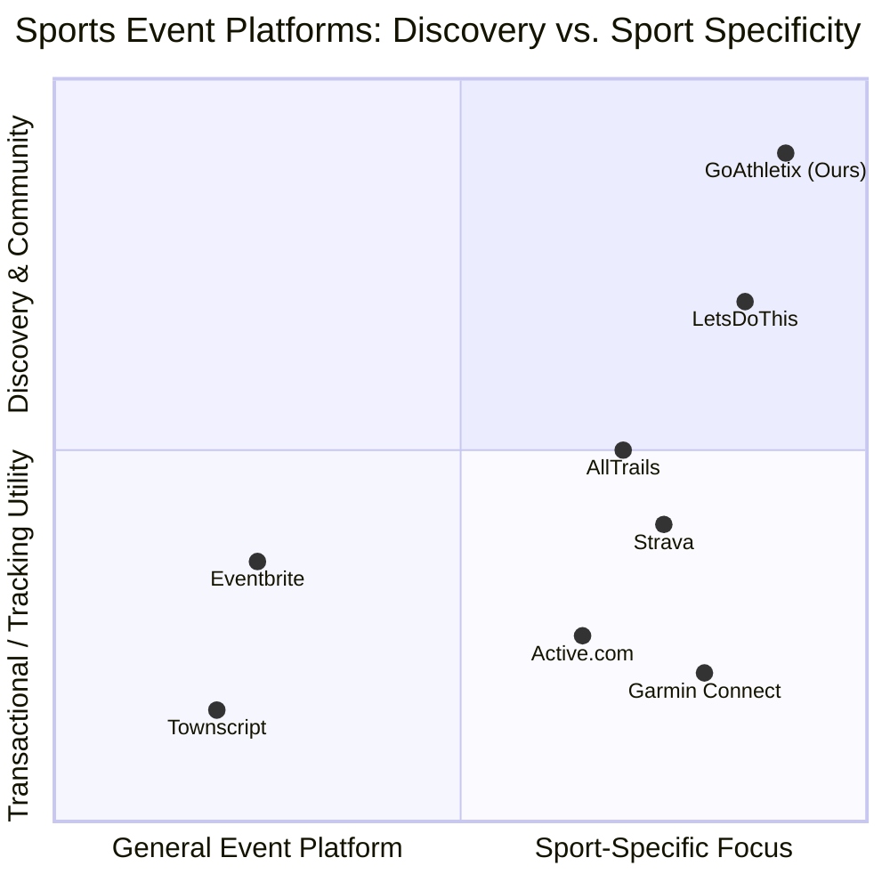
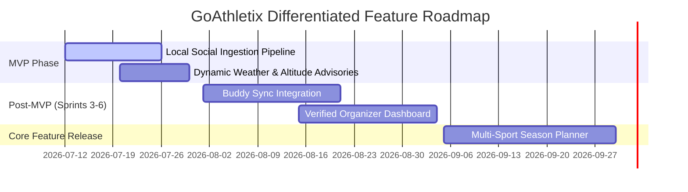

# Competitor Gaps & High-Value Differentiated Features
**Document ID:** 23-competitor-gaps-features  
**Author:** Product Strategy Lead, GoAthletix  
**Last Updated:** July 2026  
**Scope:** Competitive gap assessment and feature blueprint for GoAthletix (discovery-first, multi-sport platform for India and Southeast Asia).

---

## 1. Executive Summary

The active lifestyle and endurance sports market in India (running, cycling, triathlons, treks) is experiencing exponential growth, yet event discovery remains severely fragmented. Existing solutions are either globally generic transactional tools, hardware-dependent training silos, or static, single-sport directories. 

GoAthletix occupies a vacant strategic quadrant: **discovery-first, multi-sport, deeply localized for the Indian context, community-integrated (WhatsApp/Instagram), and entirely free for both participants and organizers.**

By positioning itself as a top-of-funnel discovery aggregator rather than a transactional ticketing platform, GoAthletix avoids the high friction and fees of direct ticketing, allowing rapid integration of existing event lists and positioning the product as a growth driver for organizers.

---

## 2. Competitive Positioning Matrix

---

## 3. In-Depth Competitor Analysis & User Pain Areas

### 3.1 Eventbrite
*   **Core Focus:** Global horizontal self-service ticketing.
*   **Strengths:** Frictionless page creation, dominant Google SEO ranking, and trusted global payment infrastructure.
*   **Weaknesses & Pain Areas:**
    *   **Generic Dumping Ground:** Sports events are buried next to pottery classes and business seminars. There is no concept of sport-specific metadata.
    *   **No Sport Filtering:** Users cannot filter by elevation, race distance, terrain type, or difficulty.
    *   **Transactional Isolation:** Zero community layers, social proof, or multi-event planning.
    *   **High Fee Erosion:** Charging 3.7% + ₹25 per ticket hurts low-ticket Indian events (e.g. ₹400-₹600 local 5Ks lose up to 10% of gross revenue to ticketing fees).
*   **The GoAthletix Opportunity:** Aggregate Eventbrite links, extracting their sports-specific metadata (distance, elevation) to present them in a dedicated athletic UI.

### 3.2 Active.com
*   **Core Focus:** US-based mass-participation registration software.
*   **Strengths:** Robust registration infrastructure, group discounts, and timing chip integration for mega-races.
*   **Weaknesses & Pain Areas:**
    *   **Zero India Focus:** No localized content, currency support, or listing coverage for India.
    *   **Dated and Cluttered UX:** Ad-heavy interface reminiscent of late-2000s portals, rendering poorly on mobile devices.
    *   **High Booking Friction:** Mandatory account creation and high processing fees (5-7%).
*   **The GoAthletix Opportunity:** Target the mobile-first Indian runner with a clean, lightweight web app that loads instantly even on standard mobile connections.

### 3.3 Townscript
*   **Core Focus:** India's dominant event ticketing platform.
*   **Strengths:** Seamless local payment integration (UPI, RuPay, Paytm), low ticketing fees, and high adoption among Indian race directors.
*   **Weaknesses & Pain Areas:**
    *   **Search is Broken:** The "Explore" page is poorly indexed and lacks basic search capability.
    *   **Pure Transactional Merchant:** Treating all events (comedy shows, workshops, runs) as tickets. No athlete profiles, training sync, or saved event history.
    *   **No Organically Shareable Assets:** Organizers are left to design their own flyers and copy-paste URLs.
*   **The GoAthletix Opportunity:** Build a beautiful discovery layer on top of Townscript. Instead of competing on payments, drive high-intent traffic to the Townscript checkout pages via direct outbound links.

### 3.4 LetsDoThis
*   **Core Focus:** Premium sports discovery and booking engine (US, UK, Europe).
*   **Strengths:** Highly polished UI, personalized discovery quizzes, and exclusive organizer deals.
*   **Weaknesses & Pain Areas:**
    *   **Geographic Blindspot:** Zero presence in India or Southeast Asia.
    *   **High Middleman Commissions:** Monetizing through 5-10% ticket commissions, a fee structure that Indian event organizers actively reject.
    *   **No Self-Service Scale:** Curation is manual, making it impossible to support the long-tail of smaller local clubs in Tier-2/Tier-3 Indian cities.
*   **The GoAthletix Opportunity:** Launch a free self-service portal for long-tail event directors in India, providing LetsDoThis-level search quality with zero ticketing overhead.

### 3.5 Strava
*   **Core Focus:** Social network for athletic tracking.
*   **Strengths:** Segment leaderboards, device synchronization, and strong peer engagement (kudos).
*   **Weaknesses & Pain Areas:**
    *   **Events are a Ghost Town:** The "Clubs & Events" feature has no central search or filtering, making it impossible to find official upcoming events.
    *   **Indian Mapping Gaps:** Route heatmaps are highly skewed toward elite corridors, neglecting trail or trekking regions.
    *   **Aggressive Paywall:** Features like route planning and segments are locked behind the ₹4,500/year subscription.
*   **The GoAthletix Opportunity:** Separate "training" from "planning." Leave training to Strava, but let GoAthletix be the ultimate central calendar for choosing *where* to compete.

### 3.6 Garmin (Garmin Connect)
*   **Core Focus:** Companion application for Garmin hardware.
*   **Strengths:** Best-in-class performance metrics, adaptive coaching plans, and route syncing to devices.
*   **Weaknesses & Pain Areas:**
    *   **Walled Garden:** Exclusive to Garmin owners, shutting out the 95% of fitness enthusiasts using smartwatches, Apple Watches, or smartphones.
    *   **No Event Directory:** No calendar of upcoming races.
    *   **Complex UI:** Intimidating dashboards filled with dense data charts.
*   **The GoAthletix Opportunity:** Act as a device-agnostic community platform, allowing any runner or trekker to join calendar syncs regardless of their hardware.

### 3.7 AllTrails
*   **Core Focus:** Trail maps and hiking route database.
*   **Strengths:** Comprehensive trail database, user reviews, elevation profiles, and offline GPX navigation.
*   **Weaknesses & Pain Areas:**
    *   **Lacks Organized Events:** It is a directory of routes, not a calendar of races. If a trail marathon is happening on a route next Sunday, AllTrails will not list it.
    *   **Unreliable Indian Trail Data:** Route logs in India are sparse, outdated, and heavily rely on tourist logs, missing local seasonal monsoon trail closures.
*   **The GoAthletix Opportunity:** List organized events specifically taking place on these trails, incorporating regional terrain warnings and organizer-led logistics.

---

## 4. Competitive Analysis Summary Matrix

| Platform | Multi-Sport | India Localization | Discovery Focus | Detail Level (Elevation/Distance) | Organizer Sharing Tools | Free to Use | Community Features |
| :--- | :---: | :---: | :---: | :---: | :---: | :---: | :---: |
| **Eventbrite** | No | Weak | Generic | No | Basic | Partial | No |
| **Active.com** | Yes | None | Reg-First | No | No | No | No |
| **Townscript** | No | Strong | Transaction-First | No | No | Partial | No |
| **LetsDoThis** | Yes | None | Discovery-First | Yes | No | No | No |
| **Strava** | Yes | Weak | Training-First | No | No | Partial | Yes |
| **Garmin Connect**| Yes | None | Performance-First| No | No | Yes | Weak |
| **AllTrails** | No | Weak | Trail-First | Yes | No | Partial | Weak |
| **GoAthletix** | **Yes** | **Strong** | **Discovery-First**| **Yes** | **Yes** | **Yes** | **Yes** |

---

## 5. Differentiated Feature Blueprint for GoAthletix

To exploit these competitor weaknesses and gaps, GoAthletix will implement five core differentiated features, addressing the specific pain points of Indian endurance athletes and event organizers.

### 5.1 Dynamic Multi-Sport Season Planner
*   **Competitor Target:** Solves the lack of seasonal planning in **Eventbrite**, **LetsDoThis**, and **Strava**.
*   **User Pain Solved:** Endurance athletes train in seasonal blocks (e.g. running in winter, trekking in monsoon, cycling in summer). They struggle to map out preparation events (e.g., a 10K test run) that align with their primary target (e.g., a Tata Mumbai Marathon half-marathon).
*   **Feature Mechanics:**
    *   An interactive, drag-and-drop calendar interface allowing users to pin a "Target A-Race" (primary goal).
    *   AI-driven suggestions that recommend "B-Races" or preparation events in their region at optimal intervals (e.g., recommending a local 10K four weeks prior to a half-marathon).
    *   Visual progression track displaying total planned distance and training load trends across different sports throughout the year.

### 5.2 Buddy Calendar Matching & Sync (Buddy Sync)
*   **Competitor Target:** Solves the weak social and coordination layer in **Townscript**, **Garmin**, and **AllTrails**.
*   **User Pain Solved:** Athletes rarely travel to events alone. Coordinating hotel bookings, travel logistics, and determining who has registered for what race occurs in chaotic, unindexed WhatsApp threads.
*   **Feature Mechanics:**
    *   Allows users to generate a private sharing URL for their active season calendar.
    *   Friends can overlay their calendars to instantly view overlapping events they are both attending.
    *   Highlights shared training windows and suggests events nearby that fit both users' distance and sport profiles.
    *   Provides an in-app check-off list showing travel arrangements (carpooling, hotel sharing) for specific upcoming events.

### 5.3 High-Altitude/Weather Dynamic Advisories
*   **Competitor Target:** Solves the static data limitations in **AllTrails** and **Active.com**.
*   **User Pain Solved:** Indian trail running, trekking, and high-altitude road cycling (e.g., Ladakh, Western Ghats during monsoons) are highly vulnerable to extreme weather, mudslides, and altitude sickness (AMS). Generic event pages ignore these conditions.
*   **Feature Mechanics:**
    *   Integrates live weather APIs and terrain-elevation models directly onto event detail pages.
    *   Dynamically displays acclimatization guides for high-altitude races (e.g., requiring 48 hours of rest at Leh before race start).
    *   Provides monsoon-specific advisories (e.g. terrain slickness levels, stream crossing hazard indices, mandatory gear requirements like trail gaiters or windbreakers).
    *   Flags wet-bulb temperatures and heat indices for summer road races in hot zones.

### 5.4 Local Social Ingestion & Scraping Integration
*   **Competitor Target:** Solves the fragmentation across local **WhatsApp** and **Instagram** groups.
*   **User Pain Solved:** 70% of long-tail community sports events in India (local club rides, weekend run meetups, forest trail runs) are only announced via text forwards in private WhatsApp groups or image posts on Instagram, never reaching search engines.
*   **Feature Mechanics:**
    *   An automated scraping pipeline targeting running/cycling club Instagram handles, community web calendars, and organizer pages.
    *   AI-powered parser (LLM-based text extractor) that processes unstructured event descriptions (e.g. "Sunday ride to Nandi Hills, meeting at Silk Board at 5:30am, ₹100 registration fee") and extracts: Sport, Location, Date, Time, Cost, and Registration Link.
    *   Automatically formats and populates the database as a "Draft Listing," notifying the organizer to claim it.

### 5.5 Verified Organizer Outreach & Analytics Dashboard
*   **Competitor Target:** Solves high commission fees and lack of marketing support in **Eventbrite** and **Townscript**.
*   **User Pain Solved:** Race organizers spend massive amounts of time manually typing out promotion messages for WhatsApp, designing Instagram story cards, and tracking where their registrations are originating.
*   **Feature Mechanics:**
    *   **Zero-Fee Dashboard:** Free analytics showcasing page views, bookmark count, calendar additions, and outbound registration clicks.
    *   **One-Tap WhatsApp Invite Generator:** Instantly converts the event detail page into a structured, highly engaging text template (e.g. *🔥 Bangalore Cycling Brevet: 200km, Oct 12. Register here: [Link]*) optimized for direct group forwarding.
    *   **Dynamic Story Card Generator:** Automatically creates customized, high-contrast, visual assets (images) containing event details and a QR code, ready for Instagram Stories.

---

## 6. Implementation & Roadmap Alignment

To maintain a "brutally practical" approach, these high-value features will be integrated into the existing Sprint roadmap:

> [!TIP]
> **Priority Focus:** Initial scraping must focus heavily on India's primary ticketing sources (Townscript) and local social channels to establish data superiority before implementing advanced planning features.
